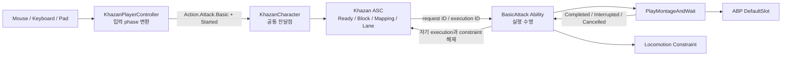

# P1 공동 구현 실습판 — ActionRequest, Basic Attack, Jump 수직 절편

작성일: 2026-09-15  
상태: **사용자 적용 전 제안 코드**. 이 문서 작성만으로 Source/BP/에셋이 변경되거나 빌드된 것은 아니다.

## 0. 현재 P1을 시작해도 되는가

결론은 **시작해도 된다**.

- M1의 공통 ASC 연결은 현재 `AKhazanCharacter`에 존재한다.
- M2.1의 `Block.Movement.Input` 소비 경로와 M2.2의 Definition/Locomotion/CMC 단일 작성 경로가 존재한다.
- `/Game/Data/DA_InputData`에는 Move/Sprint/Turn/Jump/Attack 다섯 태그와 액션 참조가 저장돼 있다.
- `/Game/Data/PDA_AssetData`와 `BP_KhazanPlayer`에는 `AssetData.CharacterDefinition.Khazan` 연결이 저장돼 있다.
- 최신 UBT 기록은 `KhazanEditor Win64 Development`에 대해 `Result: Succeeded`, `Target is up to date`다.
- 현재 `AKhazanPlayerController::Input_Attack()`은 비어 있고, Jump는 `Character::Jump()`와 시험 진동을 직접 호출한다. P1이 실제로 이 우회를 인수할 수 있는 상태다.
- `GameplayAbilities`, `GameplayTasks`, `GameplayTags` 모듈은 이미 `Khazan.Build.cs`에 있다.
- M2.3 AI 코드와 custom CMC는 아직 적용되지 않았다. 최신 Player 우선 순서와 일치한다.

현재 Editor 프로세스가 실행 중이다. 아래 UCLASS/USTRUCT와 ASC default subobject class를 바꿀 때는 Editor를 완전히 닫고 전체 빌드한다. 이번 단계에서는 Live Coding을 검증 수단으로 사용하지 않는다.

## 1. P1에서 완성할 동작

한 번의 공격 입력은 다음 경로를 지난다.



Jump도 같은 요청 경로를 사용한다. Jump Ability는 `ACharacter::Jump()`를 실행하고, 입력 `Completed`에서 `StopJumping()`을 호출하며 끝난다. Controller는 장치 입력만 해석하고 Jump의 허용 조건이나 실행 수명을 소유하지 않는다.

P1의 완료 범위는 다음과 같다.

1. `Input.Action.*`와 분리된 `Action.*` 의미 요청을 만든다.
2. ASC가 요청 ID와 실행 ID를 서로 다르게 발급한다.
3. Character Definition의 AbilitySet이 action tag와 실제 Ability Spec을 연결한다.
4. `State.Ready.Gameplay`가 ActorInfo, Definition, Locomotion, Ability grant, Player 입력 어댑터 준비 뒤에만 생긴다.
5. 전신 lane에는 한 번에 실행 하나만 들어간다.
6. 두 번째 공격 입력은 P1에서 버퍼링하지 않고 `FullBodyLaneOccupiedNoBuffer`로 거절한다.
7. Basic Attack Ability가 Montage Task와 Movement Constraint handle을 소유한다.
8. 정상 종료, 몽타주 중단, 입력 취소, UnPossess, EndPlay에서 자기 자원만 정리한다.
9. Jump의 직접 Controller 호출과 시험 진동을 제거한다.

이번에 구현하지 않는 범위는 hit trace, damage, AttributeSet/Stamina, Combo graph/buffer, Parry/Deflect, Death/Respawn, AIController/BT, custom CMC다.

## 2. 값과 소유권

| 값 | 작성자 | 소비자 | 수명과 Reset |
| --- | --- | --- | --- |
| `Input.Action.Attack` | InputData | PlayerController | 에셋 기본값. 장치 액션을 찾는 key |
| `Action.Attack.Basic` | PlayerController | Khazan ASC / AbilitySet mapping | 입력 장치와 무관한 행동 의미 |
| Request ID | Khazan ASC | Controller, ASC 진단, 실행 record | Started마다 증가. 입력 Completed/Canceled 또는 source 종료에서 폐기 |
| Execution ID | Khazan ASC | 활성 Ability와 lane | Ability 실행마다 증가. EndAbility에서 폐기 |
| `State.Ready.Gameplay` | Khazan ASC의 준비 기여 1건 | 요청 gate와 Ability Required Tags | foundation과 request source가 모두 준비된 동안만 1 count 유지 |
| `State.Action.Attack` | GAS ActivationOwnedTags | gameplay/표현 관측자 | Basic Attack Ability 활성 수명과 같음 |
| 전신 lane | Khazan ASC | 공통 action 중재 | 현재 execution ID 하나. 해당 Ability 종료 때만 해제 |
| Montage Task | Basic Attack Ability 인스턴스 | GAS/AnimInstance | Ability 실행마다 생성, Ability 종료에서 Task 수명 종료 |
| Movement Constraint handle | Basic Attack Ability 인스턴스 | LocomotionComponent | 실행마다 Acquire, 모든 EndAbility에서 Release |
| raw 이동 intent | 기존 Player/Locomotion | Locomotion policy | 공격 중에도 기존 M2.2 계약대로 보존 |

Request ID와 Execution ID를 분리하는 이유는 한 요청이 거절될 수도 있고, 향후 하나의 콤보 실행이 여러 입력 요청을 받을 수도 있기 때문이다. Ability Spec handle은 "부여된 Ability 종류"의 식별자라 같은 평타를 다시 실행해도 바뀌지 않는다. 따라서 Spec handle을 실행 ID로 대신 쓰지 않는다.

## 3. 적용 순서와 중간 정지점

아래 순서를 바꾸지 않는다.

| 정지점 | 작업 | 그 시점의 확인 |
| --- | --- | --- |
| P1-A | native tag와 `KhazanActionTypes.h` | 정적 타입만 추가. 아직 빌드하지 않아도 됨 |
| P1-B | Khazan ASC, GameplayAbility base | 요청/실행 장부가 실제 BasicAttack/Jump에서 곧 소비됨 |
| P1-C | AbilitySet, BasicAttack, Jump | 새 파일끼리 계약 완성 |
| P1-D | Definition, Character, Locomotion getter | grant/Ready/teardown 조립 완성 |
| P1-E | PlayerController 입력 phase 이관 | 빈 Attack과 Jump 직접 호출 제거 |
| P1-F | Editor 종료 전체 빌드 | UHT, C++, 기존 BP CDO 확인 |
| P1-G | Montage/GA Blueprint/AbilitySet DataAsset | 실제 콘텐츠 연결 |
| P1-H | 새 Editor/PIE 검증 | 요청, lane, montage, constraint, cleanup 확인 |

P1-E까지 일부만 저장한 채 Editor를 열지 않는다. P1-F 빌드가 통과한 뒤 콘텐츠를 만든다.

## 4. P1-A — 실제로 소비할 native tag만 추가

### 4.1 `Source/Khazan/KhazanGameplayTags.h`

기존 Input Action 선언 다음에 의미 action을, AssetLabel 다음에 Ability/State를, 기존 Block 영역에 Action block을 추가한다.

```cpp
// Semantic Action Tags
UE_DECLARE_GAMEPLAY_TAG_EXTERN(Action_Jump);
UE_DECLARE_GAMEPLAY_TAG_EXTERN(Action_Attack_Basic);

// Ability Asset Tags
UE_DECLARE_GAMEPLAY_TAG_EXTERN(Ability_Action_Jump);
UE_DECLARE_GAMEPLAY_TAG_EXTERN(Ability_Action_Attack_Basic);

// Owned / Lifecycle State Tags
UE_DECLARE_GAMEPLAY_TAG_EXTERN(State_Ready_Gameplay);
UE_DECLARE_GAMEPLAY_TAG_EXTERN(State_Action_Jump);
UE_DECLARE_GAMEPLAY_TAG_EXTERN(State_Action_Attack);

// Block Tags
UE_DECLARE_GAMEPLAY_TAG_EXTERN(Block_Movement_Input);
UE_DECLARE_GAMEPLAY_TAG_EXTERN(Block_Action_Input);
```

기존 `Block_Movement_Input` 선언은 지우고 다시 만드는 것이 아니라, 그 줄 아래에 `Block_Action_Input` 한 줄만 추가한다.

### 4.2 `Source/Khazan/KhazanGameplayTags.cpp`

헤더와 같은 영역 순서로 정의한다.

```cpp
// Semantic Action Tags
UE_DEFINE_GAMEPLAY_TAG(Action_Jump, "Action.Jump");
UE_DEFINE_GAMEPLAY_TAG(Action_Attack_Basic, "Action.Attack.Basic");

// Ability Asset Tags
UE_DEFINE_GAMEPLAY_TAG(Ability_Action_Jump, "Ability.Action.Jump");
UE_DEFINE_GAMEPLAY_TAG(Ability_Action_Attack_Basic, "Ability.Action.Attack.Basic");

// Owned / Lifecycle State Tags
UE_DEFINE_GAMEPLAY_TAG(State_Ready_Gameplay, "State.Ready.Gameplay");
UE_DEFINE_GAMEPLAY_TAG(State_Action_Jump, "State.Action.Jump");
UE_DEFINE_GAMEPLAY_TAG(State_Action_Attack, "State.Action.Attack");

// Block Tags
UE_DEFINE_GAMEPLAY_TAG(Block_Movement_Input, "Block.Movement.Input");
UE_DEFINE_GAMEPLAY_TAG(Block_Action_Input, "Block.Action.Input");
```

각 namespace의 의미는 다르다.

- `Input.Action.Attack`은 `DA_InputData`에서 `IA_Attack`을 찾는다.
- `Action.Attack.Basic`은 Player와 미래 AI가 공통으로 요청하는 의미다.
- `Ability.Action.Attack.Basic`은 Ability 클래스 자체의 분류다.
- `State.Action.Attack`은 Ability가 실제 활성인 동안 ASC가 소유하는 상태다.
- `Block.Action.Input`은 새 일반 action 요청을 막는다. 현재 실행을 자동 취소하지 않는다.

Combo/Parry/Death/AI tag는 이번 파일에 추가하지 않는다.

## 5. P1-A — `KhazanActionTypes.h`

새 파일 `Source/Khazan/Ability/KhazanActionTypes.h`를 만든다. 이 타입들은 현재 C++ 호출자만 사용하므로 USTRUCT/UENUM 반사를 먼저 추가하지 않는다.

```cpp
#pragma once

#include "CoreMinimal.h"
#include "GameplayTagContainer.h"

enum class EKhazanActionInputPhase : uint8
{
	Started,
	Completed,
	Canceled
};

enum class EKhazanActionRequestOutcome : uint8
{
	Rejected,
	Activated,
	InputReleased,
	Canceled
};

enum class EKhazanActionRequestFailure : uint8
{
	None,
	MissingAbilitySystem,
	InvalidSource,
	InvalidActionTag,
	InvalidInputPhase,
	UnexpectedRequestId,
	UnknownRequestId,
	ActionTagMismatch,
	NotReady,
	InputBlocked,
	AbilityNotGranted,
	AmbiguousAbilityMapping,
	InvalidAbilityMapping,
	FullBodyLaneOccupiedNoBuffer,
	ReentrantActivation,
	AbilityCouldNotActivate,
	ExecutionDidNotStart,
	IdExhausted
};

enum class EKhazanAbilityExecutionPolicy : uint8
{
	Independent,
	ExclusiveFullBody
};

struct KHAZAN_API FKhazanActionRequest
{
	FGameplayTag ActionTag;
	EKhazanActionInputPhase InputPhase = EKhazanActionInputPhase::Started;
	uint64 RequestId = 0;
};

struct KHAZAN_API FKhazanActionRequestResult
{
	EKhazanActionRequestOutcome Outcome = EKhazanActionRequestOutcome::Rejected;
	EKhazanActionRequestFailure Failure = EKhazanActionRequestFailure::None;
	uint64 RequestId = 0;
	uint64 ExecutionId = 0;

	bool IsAccepted() const
	{
		return Outcome != EKhazanActionRequestOutcome::Rejected;
	}
};

struct KHAZAN_API FKhazanActionExecutionHandle
{
public:
	bool IsValid() const
	{
		return Owner.IsValid() && ExecutionId != 0;
	}

	uint64 GetExecutionId() const
	{
		return ExecutionId;
	}

	void Reset()
	{
		Owner.Reset();
		ExecutionId = 0;
	}

private:
	friend class UKhazanAbilitySystemComponent;

	TWeakObjectPtr<UObject> Owner;
	uint64 ExecutionId = 0;
};

inline const TCHAR* LexToString(const EKhazanActionRequestOutcome Outcome)
{
	switch (Outcome)
	{
	case EKhazanActionRequestOutcome::Rejected:      return TEXT("Rejected");
	case EKhazanActionRequestOutcome::Activated:     return TEXT("Activated");
	case EKhazanActionRequestOutcome::InputReleased: return TEXT("InputReleased");
	case EKhazanActionRequestOutcome::Canceled:      return TEXT("Canceled");
	default:                                         return TEXT("UnknownOutcome");
	}
}

inline const TCHAR* LexToString(const EKhazanActionRequestFailure Failure)
{
	switch (Failure)
	{
	case EKhazanActionRequestFailure::None:                         return TEXT("None");
	case EKhazanActionRequestFailure::MissingAbilitySystem:         return TEXT("MissingAbilitySystem");
	case EKhazanActionRequestFailure::InvalidSource:                 return TEXT("InvalidSource");
	case EKhazanActionRequestFailure::InvalidActionTag:              return TEXT("InvalidActionTag");
	case EKhazanActionRequestFailure::InvalidInputPhase:             return TEXT("InvalidInputPhase");
	case EKhazanActionRequestFailure::UnexpectedRequestId:           return TEXT("UnexpectedRequestId");
	case EKhazanActionRequestFailure::UnknownRequestId:              return TEXT("UnknownRequestId");
	case EKhazanActionRequestFailure::ActionTagMismatch:             return TEXT("ActionTagMismatch");
	case EKhazanActionRequestFailure::NotReady:                      return TEXT("NotReady");
	case EKhazanActionRequestFailure::InputBlocked:                  return TEXT("InputBlocked");
	case EKhazanActionRequestFailure::AbilityNotGranted:             return TEXT("AbilityNotGranted");
	case EKhazanActionRequestFailure::AmbiguousAbilityMapping:       return TEXT("AmbiguousAbilityMapping");
	case EKhazanActionRequestFailure::InvalidAbilityMapping:         return TEXT("InvalidAbilityMapping");
	case EKhazanActionRequestFailure::FullBodyLaneOccupiedNoBuffer:  return TEXT("FullBodyLaneOccupiedNoBuffer");
	case EKhazanActionRequestFailure::ReentrantActivation:           return TEXT("ReentrantActivation");
	case EKhazanActionRequestFailure::AbilityCouldNotActivate:       return TEXT("AbilityCouldNotActivate");
	case EKhazanActionRequestFailure::ExecutionDidNotStart:          return TEXT("ExecutionDidNotStart");
	case EKhazanActionRequestFailure::IdExhausted:                   return TEXT("IdExhausted");
	default:                                                         return TEXT("UnknownFailure");
	}
}
```

### 5.1 줄별 의미

- `Started`, `Completed`, `Canceled`는 Enhanced Input의 장치 event를 그대로 보관하려는 값이 아니다. 공통 gameplay 입력 수명으로 번역한 값이다.
- Started 요청의 `RequestId`는 반드시 0이다. ASC가 새 ID를 발급해 결과로 돌려준다.
- Completed/Canceled는 Started 결과의 ID를 다시 보낸다. 오래된 Controller가 임의 action을 해제하지 못하게 하는 최소 소유권 검사다.
- `Outcome`은 요청이 어떻게 처리됐는지, `Failure`는 거절됐다면 왜 그랬는지를 나타낸다.
- P1에는 일반 pending queue가 없다. 따라서 lane 점유 중 재입력은 `FullBodyLaneOccupiedNoBuffer`라는 명시적 실패다.
- `Independent`와 `ExclusiveFullBody`는 실행의 배타 정책이다. P1의 Attack/Jump는 둘 다 전신 lane을 쓴다. 이후 passive나 관측 Ability가 생길 때만 Independent를 실제로 선택한다.
- `FKhazanActionExecutionHandle`은 Locomotion constraint handle과 같은 영수증 역할이다. 외부가 Owner와 ID를 조작하지 못하고 ASC만 발급한다.
- `uint64`의 0은 무효값이다. 값은 Pawn/ASC 런타임 진단용이며 저장 데이터나 원작 gameplay 수치가 아니다.
- `LexToString`은 Player 입력 로그에서 결과를 읽기 위한 실제 소비 함수다.

## 6. P1-B — `UKhazanAbilitySystemComponent`

### 6.1 헤더

새 파일 `Source/Khazan/Ability/KhazanAbilitySystemComponent.h`를 만든다.

```cpp
#pragma once

#include "CoreMinimal.h"
#include "AbilitySystemComponent.h"
#include "Ability/KhazanActionTypes.h"
#include "KhazanAbilitySystemComponent.generated.h"

class UKhazanGameplayAbility;

UCLASS()
class KHAZAN_API UKhazanAbilitySystemComponent : public UAbilitySystemComponent
{
	GENERATED_BODY()

public:
	void SetGameplayFoundationReady(bool bReady);

	bool RegisterActionRequestSource(UObject* Source);
	void UnregisterActionRequestSource(UObject* Source);

	FKhazanActionRequestResult SubmitActionRequest(
		UObject* RequestSource,
		const FKhazanActionRequest& Request);

	bool BeginActionExecution(
		UKhazanGameplayAbility* Ability,
		const FGameplayAbilitySpecHandle AbilityHandle,
		FKhazanActionExecutionHandle& OutExecutionHandle);

	bool ConfirmActionExecutionStarted(
		UKhazanGameplayAbility* Ability,
		const FKhazanActionExecutionHandle& ExecutionHandle);

	void EndActionExecution(
		UKhazanGameplayAbility* Ability,
		FKhazanActionExecutionHandle& ExecutionHandle,
		bool bWasCancelled);

	bool IsGameplayReady() const;
	uint64 GetActiveFullBodyExecutionId() const
	{
		return ActiveFullBodyExecutionId;
	}

	virtual void DestroyActiveState() override;

private:
	struct FPendingActionActivation
	{
		TWeakObjectPtr<UObject> RequestSource;
		FGameplayTag ActionTag;
		FGameplayAbilitySpecHandle AbilityHandle;
		uint64 RequestId = 0;
		uint64 ExecutionId = 0;
		bool bExecutionConfirmed = false;
	};

	struct FActiveInputRequest
	{
		TWeakObjectPtr<UObject> RequestSource;
		FGameplayTag ActionTag;
		FGameplayAbilitySpecHandle AbilityHandle;
	};

	struct FActiveActionExecution
	{
		TWeakObjectPtr<UObject> RequestSource;
		TWeakObjectPtr<UKhazanGameplayAbility> Ability;
		FGameplayTag ActionTag;
		FGameplayAbilitySpecHandle AbilityHandle;
		EKhazanAbilityExecutionPolicy ExecutionPolicy =
			EKhazanAbilityExecutionPolicy::Independent;
		uint64 RequestId = 0;
		bool bExecutionConfirmed = false;
	};

	FKhazanActionRequestResult HandleActionInputEnded(
		UObject* RequestSource,
		const FKhazanActionRequest& Request);

	EKhazanActionRequestFailure FindAbilityForAction(
		const FGameplayTag& ActionTag,
		FGameplayAbilitySpecHandle& OutAbilityHandle,
		const UKhazanGameplayAbility*& OutAbilityCDO) const;

	void CancelActionRequestsFromSource(UObject* Source);
	void CancelExecutionForRequest(uint64 RequestId);
	uint64 FindExecutionIdForRequest(uint64 RequestId) const;
	void RefreshGameplayReadyTag();

	static bool TryAllocateId(uint64& Counter, uint64& OutId);
	static FKhazanActionRequestResult MakeRejected(
		uint64 RequestId,
		EKhazanActionRequestFailure Failure);

private:
	bool bGameplayFoundationReady = false;
	bool bOwnsGameplayReadyTagContribution = false;
	TWeakObjectPtr<UObject> ActionRequestSource;

	uint64 NextRequestId = 0;
	uint64 NextExecutionId = 0;
	uint64 ActiveFullBodyExecutionId = 0;

	TOptional<FPendingActionActivation> PendingActionActivation;
	TMap<uint64, FActiveInputRequest> ActiveInputRequests;
	TMap<uint64, FActiveActionExecution> ActiveExecutions;
};
```

### 6.2 헤더의 책임

- `SetGameplayFoundationReady()`는 Character가 ActorInfo, Definition, 이동 config, Ability grant를 모두 끝냈다는 내부 신호다. 이 bool 자체를 외부 gameplay state로 읽지 않는다.
- `RegisterActionRequestSource()`는 현재 Controller가 입력/AI 어댑터 준비를 끝냈음을 등록한다.
- `State.Ready.Gameplay`는 위 두 조건을 AND한 결과다.
- `SubmitActionRequest()`만 일반 Player/AI action의 공개 진입점이다.
- `Begin/Confirm/EndActionExecution()`은 Ability base와 ASC 사이의 실행 수명 계약이다.
- `PendingActionActivation`은 `TryActivateAbility()`의 동기 호출 동안만 존재한다. 요청이 어느 Ability 활성화를 만들었는지 전달한다.
- `ActiveInputRequests`는 Started ID를 Completed/Canceled와 연결한다.
- `ActiveExecutions`는 Ability 실행 ID를 소유한다.
- `ActiveFullBodyExecutionId`는 전신 lane 하나의 현재 점유자다.
- `TWeakObjectPtr`는 Controller나 Ability를 강제로 살려 두지 않는다.
- `bOwnsGameplayReadyTagContribution`은 Ready 상태의 복사본이 아니라, ASC가 더한 loose-tag count 1개를 정확히 되돌리기 위한 영수증이다.

### 6.3 cpp 전반부 — Ready와 request source

새 파일 `Source/Khazan/Ability/KhazanAbilitySystemComponent.cpp`를 만들고 먼저 아래를 작성한다.

```cpp
#include "Ability/KhazanAbilitySystemComponent.h"

#include "Ability/KhazanGameplayAbility.h"
#include "GameplayAbilitySpec.h"
#include "KhazanGameplayTags.h"
#include "LogChannels.h"

void UKhazanAbilitySystemComponent::SetGameplayFoundationReady(const bool bReady)
{
	check(IsInGameThread());

	if (bGameplayFoundationReady == bReady)
	{
		return;
	}

	bGameplayFoundationReady = bReady;
	RefreshGameplayReadyTag();

	if (!bGameplayFoundationReady)
	{
		if (UObject* Source = ActionRequestSource.Get())
		{
			CancelActionRequestsFromSource(Source);
		}
	}
}

bool UKhazanAbilitySystemComponent::RegisterActionRequestSource(UObject* Source)
{
	check(IsInGameThread());

	if (!IsValid(Source))
	{
		return false;
	}

	if (ActionRequestSource.Get() == Source)
	{
		RefreshGameplayReadyTag();
		return true;
	}

	if (UObject* PreviousSource = ActionRequestSource.Get())
	{
		ActionRequestSource.Reset();
		RefreshGameplayReadyTag();
		CancelActionRequestsFromSource(PreviousSource);
	}

	ActionRequestSource = Source;
	RefreshGameplayReadyTag();
	return true;
}

void UKhazanAbilitySystemComponent::UnregisterActionRequestSource(UObject* Source)
{
	check(IsInGameThread());

	if (!IsValid(Source) || ActionRequestSource.Get() != Source)
	{
		return;
	}

	ActionRequestSource.Reset();
	RefreshGameplayReadyTag();
	CancelActionRequestsFromSource(Source);
}

bool UKhazanAbilitySystemComponent::IsGameplayReady() const
{
	return bGameplayFoundationReady &&
		ActionRequestSource.IsValid() &&
		GetTagCount(KhazanGameplayTags::State_Ready_Gameplay) > 0;
}

void UKhazanAbilitySystemComponent::RefreshGameplayReadyTag()
{
	const bool bShouldOwnReadyTag =
		bGameplayFoundationReady && ActionRequestSource.IsValid();

	if (bShouldOwnReadyTag && !bOwnsGameplayReadyTagContribution)
	{
		AddLooseGameplayTag(KhazanGameplayTags::State_Ready_Gameplay);
		bOwnsGameplayReadyTagContribution = true;

		UE_LOG(LogDefault, Display, TEXT("%s gameplay action path is Ready."),
			*GetNameSafe(GetAvatarActor_Direct()));
	}
	else if (!bShouldOwnReadyTag && bOwnsGameplayReadyTagContribution)
	{
		RemoveLooseGameplayTag(KhazanGameplayTags::State_Ready_Gameplay);
		bOwnsGameplayReadyTagContribution = false;

		UE_LOG(LogDefault, Display, TEXT("%s gameplay action path is NotReady."),
			*GetNameSafe(GetAvatarActor_Direct()));
	}
}
```

Ready tag를 ActorInfo 연결 직후 곧바로 더하지 않는 것이 핵심이다. Definition이나 AbilitySet이 빠진 Pawn도 ASC 자체는 존재할 수 있다. 그 Pawn은 `IAbilitySystemInterface` 검색에는 성공하지만 action 요청은 `NotReady`로 끝나야 한다.

source 교체 때는 Ready를 먼저 내리고 이전 source의 실행을 취소한 다음 새 source를 등록한다. 이전 Controller의 늦은 Completed/Canceled가 새 Controller의 실행을 정리하지 못한다.

### 6.4 cpp — request 시작과 종료

같은 cpp에 이어서 작성한다.

```cpp
FKhazanActionRequestResult UKhazanAbilitySystemComponent::SubmitActionRequest(
	UObject* RequestSource,
	const FKhazanActionRequest& Request)
{
	check(IsInGameThread());

	switch (Request.InputPhase)
	{
	case EKhazanActionInputPhase::Completed:
	case EKhazanActionInputPhase::Canceled:
		return HandleActionInputEnded(RequestSource, Request);

	case EKhazanActionInputPhase::Started:
		break;

	default:
		return MakeRejected(Request.RequestId,
			EKhazanActionRequestFailure::InvalidInputPhase);
	}

	if (Request.RequestId != 0)
	{
		return MakeRejected(Request.RequestId,
			EKhazanActionRequestFailure::UnexpectedRequestId);
	}

	uint64 NewRequestId = 0;
	if (!TryAllocateId(NextRequestId, NewRequestId))
	{
		return MakeRejected(0, EKhazanActionRequestFailure::IdExhausted);
	}

	if (!IsValid(RequestSource) || ActionRequestSource.Get() != RequestSource)
	{
		return MakeRejected(NewRequestId,
			EKhazanActionRequestFailure::InvalidSource);
	}

	if (!Request.ActionTag.IsValid())
	{
		return MakeRejected(NewRequestId,
			EKhazanActionRequestFailure::InvalidActionTag);
	}

	if (!IsGameplayReady())
	{
		return MakeRejected(NewRequestId,
			EKhazanActionRequestFailure::NotReady);
	}

	if (GetTagCount(KhazanGameplayTags::Block_Action_Input) > 0)
	{
		return MakeRejected(NewRequestId,
			EKhazanActionRequestFailure::InputBlocked);
	}

	FGameplayAbilitySpecHandle AbilityHandle;
	const UKhazanGameplayAbility* AbilityCDO = nullptr;

	const EKhazanActionRequestFailure MappingFailure =
		FindAbilityForAction(Request.ActionTag, AbilityHandle, AbilityCDO);

	if (MappingFailure != EKhazanActionRequestFailure::None)
	{
		return MakeRejected(NewRequestId, MappingFailure);
	}

	if (AbilityCDO->GetExecutionPolicy() ==
		EKhazanAbilityExecutionPolicy::ExclusiveFullBody &&
		ActiveFullBodyExecutionId != 0)
	{
		return MakeRejected(NewRequestId,
			EKhazanActionRequestFailure::FullBodyLaneOccupiedNoBuffer);
	}

	if (PendingActionActivation.IsSet())
	{
		return MakeRejected(NewRequestId,
			EKhazanActionRequestFailure::ReentrantActivation);
	}

	FPendingActionActivation Pending;
	Pending.RequestSource = RequestSource;
	Pending.ActionTag = Request.ActionTag;
	Pending.AbilityHandle = AbilityHandle;
	Pending.RequestId = NewRequestId;
	PendingActionActivation = MoveTemp(Pending);

	FGameplayAbilitySpec* AbilitySpec = FindAbilitySpecFromHandle(AbilityHandle);
	if (!AbilitySpec)
	{
		PendingActionActivation.Reset();
		return MakeRejected(NewRequestId,
			EKhazanActionRequestFailure::InvalidAbilityMapping);
	}

	AbilitySpecInputPressed(*AbilitySpec);
	const bool bActivationAttempted = TryActivateAbility(AbilityHandle);

	const uint64 NewExecutionId = PendingActionActivation->ExecutionId;
	const bool bExecutionConfirmed =
		PendingActionActivation->bExecutionConfirmed;

	PendingActionActivation.Reset();

	if (!bActivationAttempted || !bExecutionConfirmed)
	{
		if (NewExecutionId != 0)
		{
			CancelExecutionForRequest(NewRequestId);
		}

		if (FGameplayAbilitySpec* CurrentSpec =
			FindAbilitySpecFromHandle(AbilityHandle))
		{
			AbilitySpecInputReleased(*CurrentSpec);
		}

		return MakeRejected(
			NewRequestId,
			bActivationAttempted
				? EKhazanActionRequestFailure::ExecutionDidNotStart
				: EKhazanActionRequestFailure::AbilityCouldNotActivate);
	}

	FActiveInputRequest ActiveInput;
	ActiveInput.RequestSource = RequestSource;
	ActiveInput.ActionTag = Request.ActionTag;
	ActiveInput.AbilityHandle = AbilityHandle;
	ActiveInputRequests.Add(NewRequestId, MoveTemp(ActiveInput));

	FKhazanActionRequestResult Result;
	Result.Outcome = EKhazanActionRequestOutcome::Activated;
	Result.RequestId = NewRequestId;
	Result.ExecutionId = NewExecutionId;
	return Result;
}

FKhazanActionRequestResult
UKhazanAbilitySystemComponent::HandleActionInputEnded(
	UObject* RequestSource,
	const FKhazanActionRequest& Request)
{
	if (!IsValid(RequestSource) || ActionRequestSource.Get() != RequestSource)
	{
		return MakeRejected(Request.RequestId,
			EKhazanActionRequestFailure::InvalidSource);
	}

	if (Request.RequestId == 0)
	{
		return MakeRejected(0,
			EKhazanActionRequestFailure::UnknownRequestId);
	}

	const FActiveInputRequest* FoundInput =
		ActiveInputRequests.Find(Request.RequestId);

	if (!FoundInput)
	{
		return MakeRejected(Request.RequestId,
			EKhazanActionRequestFailure::UnknownRequestId);
	}

	if (FoundInput->RequestSource.Get() != RequestSource)
	{
		return MakeRejected(Request.RequestId,
			EKhazanActionRequestFailure::InvalidSource);
	}

	if (FoundInput->ActionTag != Request.ActionTag)
	{
		return MakeRejected(Request.RequestId,
			EKhazanActionRequestFailure::ActionTagMismatch);
	}

	const FGameplayAbilitySpecHandle AbilityHandle =
		FoundInput->AbilityHandle;
	const uint64 ExecutionId =
		FindExecutionIdForRequest(Request.RequestId);

	ActiveInputRequests.Remove(Request.RequestId);

	if (Request.InputPhase == EKhazanActionInputPhase::Canceled)
	{
		CancelExecutionForRequest(Request.RequestId);
	}

	if (FGameplayAbilitySpec* AbilitySpec =
		FindAbilitySpecFromHandle(AbilityHandle))
	{
		AbilitySpecInputReleased(*AbilitySpec);
	}

	FKhazanActionRequestResult Result;
	Result.Outcome = Request.InputPhase == EKhazanActionInputPhase::Canceled
		? EKhazanActionRequestOutcome::Canceled
		: EKhazanActionRequestOutcome::InputReleased;
	Result.RequestId = Request.RequestId;
	Result.ExecutionId = ExecutionId;
	return Result;
}
```

중요한 실행 순서는 다음과 같다.

1. Completed/Canceled는 Ready와 Block 검사를 통과할 필요가 없다. 해제는 상태가 나빠진 뒤에도 반드시 가능해야 한다.
2. Started만 새 request ID를 받는다.
3. Ready/Block/mapping/lane을 검사한 뒤 GAS Spec의 InputPressed를 기록한다.
4. `TryActivateAbility()`가 호출되는 동안 `PendingActionActivation`이 요청 문맥을 보관한다.
5. Ability가 실제 Montage/Jump 시작 지점까지 도달해 `ConfirmActionExecutionStarted()`를 호출해야 결과가 Activated가 된다.
6. GAS 활성화가 시작됐어도 constraint나 montage 시작이 실패해 confirm하지 못하면 `ExecutionDidNotStart`다.
7. Completed는 입력만 해제한다. Basic Attack Montage를 버튼을 놓았다는 이유로 중단하지 않는다.
8. Canceled는 그 request가 만든 execution만 취소한 뒤 InputPressed 상태도 내린다.

### 6.5 cpp — Ability mapping과 execution lane

```cpp
EKhazanActionRequestFailure
UKhazanAbilitySystemComponent::FindAbilityForAction(
	const FGameplayTag& ActionTag,
	FGameplayAbilitySpecHandle& OutAbilityHandle,
	const UKhazanGameplayAbility*& OutAbilityCDO) const
{
	OutAbilityHandle = FGameplayAbilitySpecHandle{};
	OutAbilityCDO = nullptr;

	int32 MatchCount = 0;

	for (const FGameplayAbilitySpec& Spec : GetActivatableAbilities())
	{
		if (Spec.PendingRemove ||
			!Spec.GetDynamicSpecSourceTags().HasTagExact(ActionTag))
		{
			continue;
		}

		++MatchCount;
		OutAbilityHandle = Spec.Handle;
		OutAbilityCDO = Cast<UKhazanGameplayAbility>(Spec.Ability);
	}

	if (MatchCount == 0)
	{
		return EKhazanActionRequestFailure::AbilityNotGranted;
	}

	if (MatchCount > 1)
	{
		return EKhazanActionRequestFailure::AmbiguousAbilityMapping;
	}

	if (!OutAbilityHandle.IsValid() || !IsValid(OutAbilityCDO))
	{
		return EKhazanActionRequestFailure::InvalidAbilityMapping;
	}

	return EKhazanActionRequestFailure::None;
}

bool UKhazanAbilitySystemComponent::BeginActionExecution(
	UKhazanGameplayAbility* Ability,
	const FGameplayAbilitySpecHandle AbilityHandle,
	FKhazanActionExecutionHandle& OutExecutionHandle)
{
	check(IsInGameThread());
	OutExecutionHandle.Reset();

	if (!IsValid(Ability) || !AbilityHandle.IsValid() ||
		!PendingActionActivation.IsSet() ||
		PendingActionActivation->AbilityHandle != AbilityHandle ||
		!PendingActionActivation->RequestSource.IsValid())
	{
		return false;
	}

	const EKhazanAbilityExecutionPolicy ExecutionPolicy =
		Ability->GetExecutionPolicy();

	if (ExecutionPolicy == EKhazanAbilityExecutionPolicy::ExclusiveFullBody &&
		ActiveFullBodyExecutionId != 0)
	{
		return false;
	}

	uint64 NewExecutionId = 0;
	if (!TryAllocateId(NextExecutionId, NewExecutionId))
	{
		return false;
	}

	FActiveActionExecution Execution;
	Execution.RequestSource = PendingActionActivation->RequestSource;
	Execution.Ability = Ability;
	Execution.ActionTag = PendingActionActivation->ActionTag;
	Execution.AbilityHandle = AbilityHandle;
	Execution.ExecutionPolicy = ExecutionPolicy;
	Execution.RequestId = PendingActionActivation->RequestId;
	ActiveExecutions.Add(NewExecutionId, MoveTemp(Execution));

	if (ExecutionPolicy == EKhazanAbilityExecutionPolicy::ExclusiveFullBody)
	{
		ActiveFullBodyExecutionId = NewExecutionId;
	}

	OutExecutionHandle.Owner = this;
	OutExecutionHandle.ExecutionId = NewExecutionId;
	PendingActionActivation->ExecutionId = NewExecutionId;
	return true;
}

bool UKhazanAbilitySystemComponent::ConfirmActionExecutionStarted(
	UKhazanGameplayAbility* Ability,
	const FKhazanActionExecutionHandle& ExecutionHandle)
{
	check(IsInGameThread());

	if (ExecutionHandle.Owner.Get() != this ||
		ExecutionHandle.ExecutionId == 0 ||
		!PendingActionActivation.IsSet())
	{
		return false;
	}

	FActiveActionExecution* Execution =
		ActiveExecutions.Find(ExecutionHandle.ExecutionId);

	if (!Execution || Execution->Ability.Get() != Ability ||
		PendingActionActivation->ExecutionId != ExecutionHandle.ExecutionId)
	{
		return false;
	}

	Execution->bExecutionConfirmed = true;
	PendingActionActivation->bExecutionConfirmed = true;
	return true;
}

void UKhazanAbilitySystemComponent::EndActionExecution(
	UKhazanGameplayAbility* Ability,
	FKhazanActionExecutionHandle& ExecutionHandle,
	const bool bWasCancelled)
{
	check(IsInGameThread());

	if (ExecutionHandle.Owner.Get() != this ||
		ExecutionHandle.ExecutionId == 0)
	{
		ExecutionHandle.Reset();
		return;
	}

	const uint64 EndingExecutionId = ExecutionHandle.ExecutionId;
	const FActiveActionExecution* Execution =
		ActiveExecutions.Find(EndingExecutionId);

	if (!Execution || Execution->Ability.Get() != Ability)
	{
		ExecutionHandle.Reset();
		return;
	}

	const FGameplayTag EndingActionTag = Execution->ActionTag;

	if (ActiveFullBodyExecutionId == EndingExecutionId)
	{
		ActiveFullBodyExecutionId = 0;
	}

	ActiveExecutions.Remove(EndingExecutionId);
	ExecutionHandle.Reset();

	UE_LOG(LogDefault, Display,
		TEXT("Action execution %llu [%s] ended. Cancelled=%s"),
		static_cast<unsigned long long>(EndingExecutionId),
		*EndingActionTag.ToString(),
		bWasCancelled ? TEXT("true") : TEXT("false"));
}
```

`FindAbilityForAction()`은 `TryActivateAbilitiesByTag()`를 쓰지 않는다. 그 API는 조건에 맞는 Ability 여러 개를 활성화할 수 있다. P1의 semantic action 하나는 정확히 Spec 하나에 대응해야 하므로 0개, 1개, 2개 이상을 구분한다.

AbilitySet이 넣을 action tag는 Spec의 `GetDynamicSpecSourceTags()`에 저장된다. Ability Asset Tags와 다른 저장소다. 전자는 "이 Definition에서 이 action 요청을 어느 Spec으로 보낼 것인가"이고, 후자는 "Ability 자체가 무슨 종류인가"다.

### 6.6 cpp — source cleanup과 보조 함수

```cpp
void UKhazanAbilitySystemComponent::CancelActionRequestsFromSource(UObject* Source)
{
	if (!IsValid(Source))
	{
		return;
	}

	TArray<uint64> InputRequestIds;
	TArray<FGameplayAbilitySpecHandle> InputAbilityHandles;
	TArray<FGameplayAbilitySpecHandle> ExecutingAbilityHandles;

	for (const TPair<uint64, FActiveInputRequest>& Pair :
		ActiveInputRequests)
	{
		if (Pair.Value.RequestSource.Get() == Source)
		{
			InputRequestIds.Add(Pair.Key);
			InputAbilityHandles.Add(Pair.Value.AbilityHandle);
		}
	}

	for (const TPair<uint64, FActiveActionExecution>& Pair : ActiveExecutions)
	{
		if (Pair.Value.RequestSource.Get() == Source)
		{
			ExecutingAbilityHandles.AddUnique(Pair.Value.AbilityHandle);
		}
	}

	for (const uint64 RequestId : InputRequestIds)
	{
		ActiveInputRequests.Remove(RequestId);
	}

	for (const FGameplayAbilitySpecHandle AbilityHandle :
		ExecutingAbilityHandles)
	{
		CancelAbilityHandle(AbilityHandle);
	}

	for (const FGameplayAbilitySpecHandle AbilityHandle : InputAbilityHandles)
	{
		if (FGameplayAbilitySpec* AbilitySpec =
			FindAbilitySpecFromHandle(AbilityHandle))
		{
			AbilitySpecInputReleased(*AbilitySpec);
		}
	}
}

void UKhazanAbilitySystemComponent::CancelExecutionForRequest(
	const uint64 RequestId)
{
	FGameplayAbilitySpecHandle AbilityHandle;

	for (const TPair<uint64, FActiveActionExecution>& Pair : ActiveExecutions)
	{
		if (Pair.Value.RequestId == RequestId)
		{
			AbilityHandle = Pair.Value.AbilityHandle;
			break;
		}
	}

	if (AbilityHandle.IsValid())
	{
		CancelAbilityHandle(AbilityHandle);
	}
}

uint64 UKhazanAbilitySystemComponent::FindExecutionIdForRequest(
	const uint64 RequestId) const
{
	for (const TPair<uint64, FActiveActionExecution>& Pair : ActiveExecutions)
	{
		if (Pair.Value.RequestId == RequestId)
		{
			return Pair.Key;
		}
	}

	return 0;
}

bool UKhazanAbilitySystemComponent::TryAllocateId(
	uint64& Counter,
	uint64& OutId)
{
	OutId = 0;

	if (Counter == MAX_uint64)
	{
		return false;
	}

	OutId = ++Counter;
	return true;
}

FKhazanActionRequestResult UKhazanAbilitySystemComponent::MakeRejected(
	const uint64 RequestId,
	const EKhazanActionRequestFailure Failure)
{
	FKhazanActionRequestResult Result;
	Result.Failure = Failure;
	Result.RequestId = RequestId;
	return Result;
}

void UKhazanAbilitySystemComponent::DestroyActiveState()
{
	TArray<FGameplayAbilitySpecHandle> PressedAbilityHandles;

	for (const TPair<uint64, FActiveInputRequest>& Pair :
		ActiveInputRequests)
	{
		PressedAbilityHandles.AddUnique(Pair.Value.AbilityHandle);
	}

	ActiveInputRequests.Empty();
	PendingActionActivation.Reset();

	Super::DestroyActiveState();

	for (const FGameplayAbilitySpecHandle AbilityHandle :
		PressedAbilityHandles)
	{
		if (FGameplayAbilitySpec* AbilitySpec =
			FindAbilitySpecFromHandle(AbilityHandle))
		{
			AbilitySpecInputReleased(*AbilitySpec);
		}
	}

	ActiveExecutions.Empty();
	ActiveFullBodyExecutionId = 0;
}
```

source cleanup은 입력 record와 실행 record를 따로 찾는다. 버튼을 이미 놓은 Basic Attack은 `ActiveInputRequests`에는 없지만 Montage가 재생 중이므로 `ActiveExecutions`에는 남아 있다. 두 장부를 모두 보지 않으면 UnPossess 때 그 공격이 남는다.

`CancelAbilityHandle()`은 그 Spec의 활성 Ability를 취소한다. P1 Ability는 `InstancedPerActor`이고 전신 lane에서 같은 Spec의 동시 실행을 허용하지 않으므로 해당 request의 실행 하나와 일치한다.

## 7. P1-B — `UKhazanGameplayAbility` base

### 7.1 헤더

새 파일 `Source/Khazan/Ability/KhazanGameplayAbility.h`를 만든다.

```cpp
#pragma once

#include "CoreMinimal.h"
#include "Abilities/GameplayAbility.h"
#include "Ability/KhazanActionTypes.h"
#include "KhazanGameplayAbility.generated.h"

UCLASS(Abstract)
class KHAZAN_API UKhazanGameplayAbility : public UGameplayAbility
{
	GENERATED_BODY()

public:
	UKhazanGameplayAbility();

	EKhazanAbilityExecutionPolicy GetExecutionPolicy() const
	{
		return ExecutionPolicy;
	}

	uint64 GetActionExecutionId() const
	{
		return ActionExecutionHandle.GetExecutionId();
	}

protected:
	bool BeginKhazanActionExecution(
		const FGameplayAbilitySpecHandle Handle,
		const FGameplayAbilityActorInfo* ActorInfo);

	bool ConfirmKhazanActionExecutionStarted();

	virtual void EndAbility(
		const FGameplayAbilitySpecHandle Handle,
		const FGameplayAbilityActorInfo* ActorInfo,
		const FGameplayAbilityActivationInfo ActivationInfo,
		bool bReplicateEndAbility,
		bool bWasCancelled) override;

	EKhazanAbilityExecutionPolicy ExecutionPolicy =
		EKhazanAbilityExecutionPolicy::Independent;

private:
	FKhazanActionExecutionHandle ActionExecutionHandle;
};
```

### 7.2 cpp

```cpp
#include "Ability/KhazanGameplayAbility.h"

#include "Ability/KhazanAbilitySystemComponent.h"

UKhazanGameplayAbility::UKhazanGameplayAbility()
{
	InstancingPolicy = EGameplayAbilityInstancingPolicy::InstancedPerActor;
	NetExecutionPolicy = EGameplayAbilityNetExecutionPolicy::LocalPredicted;
}

bool UKhazanGameplayAbility::BeginKhazanActionExecution(
	const FGameplayAbilitySpecHandle Handle,
	const FGameplayAbilityActorInfo* ActorInfo)
{
	if (ActionExecutionHandle.IsValid() || !ActorInfo)
	{
		return false;
	}

	UKhazanAbilitySystemComponent* KhazanASC =
		Cast<UKhazanAbilitySystemComponent>(
			ActorInfo->AbilitySystemComponent.Get());

	return KhazanASC &&
		KhazanASC->BeginActionExecution(this, Handle, ActionExecutionHandle);
}

bool UKhazanGameplayAbility::ConfirmKhazanActionExecutionStarted()
{
	UKhazanAbilitySystemComponent* KhazanASC =
		Cast<UKhazanAbilitySystemComponent>(GetAbilitySystemComponentFromActorInfo());

	return KhazanASC &&
		KhazanASC->ConfirmActionExecutionStarted(
			this,
			ActionExecutionHandle);
}

void UKhazanGameplayAbility::EndAbility(
	const FGameplayAbilitySpecHandle Handle,
	const FGameplayAbilityActorInfo* ActorInfo,
	const FGameplayAbilityActivationInfo ActivationInfo,
	const bool bReplicateEndAbility,
	const bool bWasCancelled)
{
	if (UKhazanAbilitySystemComponent* KhazanASC =
		Cast<UKhazanAbilitySystemComponent>(
			ActorInfo ? ActorInfo->AbilitySystemComponent.Get() : nullptr))
	{
		KhazanASC->EndActionExecution(
			this,
			ActionExecutionHandle,
			bWasCancelled);
	}
	else
	{
		ActionExecutionHandle.Reset();
	}

	Super::EndAbility(
		Handle,
		ActorInfo,
		ActivationInfo,
		bReplicateEndAbility,
		bWasCancelled);
}
```

`InstancedPerActor`를 쓰는 이유는 Basic Attack이 Montage Task와 constraint handle을 멤버로 보관하고 Jump가 입력 release까지 살아 있어야 하기 때문이다. CDO/NonInstanced Ability에 실행별 mutable 값을 두지 않는다.

`LocalPredicted`는 현행 Standalone Player에서 즉시 실행되는 GAS 정책이다. 이번 P1은 네트워크 정합성 검증 단계가 아니다. 향후 네트워크를 추가하면 request context의 prediction/replication 계약을 별도 검토해야 하며, 이번 `uint64` ID를 저장/복제 식별자로 간주하지 않는다.

## 8. P1-C — AbilitySet DataAsset

### 8.1 헤더

새 파일 `Source/Khazan/Data/KhazanAbilitySetData.h`를 만든다.

```cpp
#pragma once

#include "CoreMinimal.h"
#include "Engine/DataAsset.h"
#include "GameplayAbilitySpecHandle.h"
#include "GameplayTagContainer.h"
#include "KhazanAbilitySetData.generated.h"

class UKhazanAbilitySystemComponent;
class UKhazanGameplayAbility;

USTRUCT(BlueprintType)
struct KHAZAN_API FKhazanAbilitySetEntry
{
	GENERATED_BODY()

	UPROPERTY(EditDefaultsOnly, BlueprintReadOnly, Category = "Ability")
	TSubclassOf<UKhazanGameplayAbility> AbilityClass;

	UPROPERTY(EditDefaultsOnly, BlueprintReadOnly, Category = "Ability",
		meta = (Categories = "Action"))
	FGameplayTag ActionTag;
};

UCLASS(BlueprintType)
class KHAZAN_API UKhazanAbilitySetData : public UDataAsset
{
	GENERATED_BODY()

public:
	bool GiveToAbilitySystem(
		UKhazanAbilitySystemComponent* AbilitySystem,
		UObject* SourceObject,
		TArray<FGameplayAbilitySpecHandle>& OutGrantedHandles) const;

	static void TakeFromAbilitySystem(
		UKhazanAbilitySystemComponent* AbilitySystem,
		TArray<FGameplayAbilitySpecHandle>& GrantedHandles);

private:
	UPROPERTY(EditDefaultsOnly, BlueprintReadOnly, Category = "Ability",
		meta = (AllowPrivateAccess = "true"))
	TArray<FKhazanAbilitySetEntry> Abilities;
};
```

### 8.2 cpp

```cpp
#include "Data/KhazanAbilitySetData.h"

#include "Ability/KhazanAbilitySystemComponent.h"
#include "Ability/KhazanGameplayAbility.h"
#include "GameplayAbilitySpec.h"
#include "LogChannels.h"

bool UKhazanAbilitySetData::GiveToAbilitySystem(
	UKhazanAbilitySystemComponent* AbilitySystem,
	UObject* SourceObject,
	TArray<FGameplayAbilitySpecHandle>& OutGrantedHandles) const
{
	if (!IsValid(AbilitySystem) || !IsValid(SourceObject) ||
		!AbilitySystem->IsOwnerActorAuthoritative() ||
		OutGrantedHandles.Num() != 0 || Abilities.Num() == 0)
	{
		return false;
	}

	TSet<FGameplayTag> SeenActionTags;

	for (const FKhazanAbilitySetEntry& Entry : Abilities)
	{
		if (!Entry.AbilityClass ||
			Entry.AbilityClass->HasAnyClassFlags(CLASS_Abstract) ||
			!Entry.ActionTag.IsValid() ||
			SeenActionTags.Contains(Entry.ActionTag))
		{
			UE_LOG(LogDefault, Error,
				TEXT("Invalid or duplicate AbilitySet entry in %s."),
				*GetNameSafe(this));
			return false;
		}

		SeenActionTags.Add(Entry.ActionTag);
	}

	for (const FKhazanAbilitySetEntry& Entry : Abilities)
	{
		FGameplayAbilitySpec AbilitySpec(
			Entry.AbilityClass,
			1,
			INDEX_NONE,
			SourceObject);

		AbilitySpec.GetDynamicSpecSourceTags().AddTag(Entry.ActionTag);

		const FGameplayAbilitySpecHandle GrantedHandle =
			AbilitySystem->GiveAbility(AbilitySpec);

		if (!GrantedHandle.IsValid())
		{
			TakeFromAbilitySystem(AbilitySystem, OutGrantedHandles);
			return false;
		}

		OutGrantedHandles.Add(GrantedHandle);
	}

	return true;
}

void UKhazanAbilitySetData::TakeFromAbilitySystem(
	UKhazanAbilitySystemComponent* AbilitySystem,
	TArray<FGameplayAbilitySpecHandle>& GrantedHandles)
{
	if (IsValid(AbilitySystem) &&
		AbilitySystem->IsOwnerActorAuthoritative())
	{
		for (const FGameplayAbilitySpecHandle Handle : GrantedHandles)
		{
			if (Handle.IsValid())
			{
				AbilitySystem->ClearAbility(Handle);
			}
		}
	}

	GrantedHandles.Reset();
}
```

AbilitySet은 실행 상태를 저장하지 않는다. 읽기 전용 entry를 검증한 뒤 Spec을 grant하고, Character가 반환 handle 배열을 Pawn 수명 동안 보관한다.

`AbilityLevel` 필드는 P1에 추가하지 않는다. 현재 레벨별 계산 소비자가 없으므로 GAS 기본 실행 레벨 1만 사용한다. `INDEX_NONE`은 숫자 Input ID binding을 사용하지 않고 semantic action tag mapping을 쓴다는 뜻이다.

모든 entry를 먼저 검증하고 하나라도 grant에 실패하면 이미 부여한 handle만 되돌린다. `ClearAllAbilities()`를 호출하지 않으므로 미래 장비나 다른 source가 부여한 Spec을 지우지 않는다.

## 9. P1-C — Basic Attack Ability

### 9.1 헤더

새 파일 `Source/Khazan/Ability/KhazanBasicAttackAbility.h`를 만든다.

```cpp
#pragma once

#include "CoreMinimal.h"
#include "Ability/KhazanGameplayAbility.h"
#include "Character/Component/KhazanLocomotionComponent.h"
#include "KhazanBasicAttackAbility.generated.h"

class UAbilityTask_PlayMontageAndWait;
class UAnimMontage;

UCLASS(Abstract, Blueprintable)
class KHAZAN_API UKhazanBasicAttackAbility : public UKhazanGameplayAbility
{
	GENERATED_BODY()

public:
	UKhazanBasicAttackAbility();

	virtual bool CanActivateAbility(
		const FGameplayAbilitySpecHandle Handle,
		const FGameplayAbilityActorInfo* ActorInfo,
		const FGameplayTagContainer* SourceTags = nullptr,
		const FGameplayTagContainer* TargetTags = nullptr,
		FGameplayTagContainer* OptionalRelevantTags = nullptr) const override;

	virtual void ActivateAbility(
		const FGameplayAbilitySpecHandle Handle,
		const FGameplayAbilityActorInfo* ActorInfo,
		const FGameplayAbilityActivationInfo ActivationInfo,
		const FGameplayEventData* TriggerEventData) override;

protected:
	virtual void EndAbility(
		const FGameplayAbilitySpecHandle Handle,
		const FGameplayAbilityActorInfo* ActorInfo,
		const FGameplayAbilityActivationInfo ActivationInfo,
		bool bReplicateEndAbility,
		bool bWasCancelled) override;

private:
	UFUNCTION()
	void HandleMontageCompleted();

	UFUNCTION()
	void HandleMontageInterrupted();

	UFUNCTION()
	void HandleMontageCancelled();

	void FinishCurrentAbility(bool bWasCancelled);

private:
	UPROPERTY(EditDefaultsOnly, BlueprintReadOnly, Category = "Action|Animation",
		meta = (AllowPrivateAccess = "true"))
	TObjectPtr<UAnimMontage> AttackMontage = nullptr;

	UPROPERTY(EditDefaultsOnly, BlueprintReadOnly, Category = "Action|Animation",
		meta = (AllowPrivateAccess = "true", ClampMin = "0.0001"))
	float MontagePlayRate = 1.f;

	UPROPERTY(EditDefaultsOnly, BlueprintReadOnly, Category = "Action|Locomotion",
		meta = (AllowPrivateAccess = "true"))
	FKhazanMovementConstraint MovementConstraint;

	UPROPERTY(Transient)
	TObjectPtr<UAbilityTask_PlayMontageAndWait> MontageTask = nullptr;

	FKhazanMovementConstraintHandle MovementConstraintHandle;
};
```

### 9.2 cpp

```cpp
#include "Ability/KhazanBasicAttackAbility.h"

#include "Abilities/Tasks/AbilityTask_PlayMontageAndWait.h"
#include "Animation/AnimInstance.h"
#include "Animation/AnimMontage.h"
#include "Character/KhazanCharacter.h"
#include "Components/SkeletalMeshComponent.h"
#include "GameFramework/CharacterMovementComponent.h"
#include "KhazanGameplayTags.h"

UKhazanBasicAttackAbility::UKhazanBasicAttackAbility()
{
	ExecutionPolicy = EKhazanAbilityExecutionPolicy::ExclusiveFullBody;

	FGameplayTagContainer AssetTags;
	AssetTags.AddTag(KhazanGameplayTags::Ability_Action_Attack_Basic);
	SetAssetTags(AssetTags);

	ActivationRequiredTags.AddTag(
		KhazanGameplayTags::State_Ready_Gameplay);
	ActivationBlockedTags.AddTag(
		KhazanGameplayTags::Block_Action_Input);
	ActivationOwnedTags.AddTag(
		KhazanGameplayTags::State_Action_Attack);
}

bool UKhazanBasicAttackAbility::CanActivateAbility(
	const FGameplayAbilitySpecHandle Handle,
	const FGameplayAbilityActorInfo* ActorInfo,
	const FGameplayTagContainer* SourceTags,
	const FGameplayTagContainer* TargetTags,
	FGameplayTagContainer* OptionalRelevantTags) const
{
	if (!Super::CanActivateAbility(
		Handle,
		ActorInfo,
		SourceTags,
		TargetTags,
		OptionalRelevantTags))
	{
		return false;
	}

	const AKhazanCharacter* Character =
		ActorInfo ? Cast<AKhazanCharacter>(ActorInfo->AvatarActor.Get()) : nullptr;
	const UCharacterMovementComponent* CharacterMovement =
		Character ? Character->GetCharacterMovement() : nullptr;
	const UKhazanLocomotionComponent* Locomotion =
		Character ? Character->GetLocomotionComponent() : nullptr;

	const bool bValidConstraint =
		KhazanLocomotion::IsSupportedGait(MovementConstraint.MaxAllowedGait) &&
		(!MovementConstraint.bOverrideRotationMode ||
			KhazanLocomotion::IsSupportedRotationMode(
				MovementConstraint.RotationModeOverride));

	return Character &&
		CharacterMovement && CharacterMovement->IsMovingOnGround() &&
		Locomotion && Locomotion->HasValidMovementConfig() &&
		IsValid(AttackMontage) &&
		FMath::IsFinite(MontagePlayRate) && MontagePlayRate > 0.f &&
		Character->GetMesh() && Character->GetMesh()->GetAnimInstance() &&
		bValidConstraint;
}

void UKhazanBasicAttackAbility::ActivateAbility(
	const FGameplayAbilitySpecHandle Handle,
	const FGameplayAbilityActorInfo* ActorInfo,
	const FGameplayAbilityActivationInfo ActivationInfo,
	const FGameplayEventData* TriggerEventData)
{
	(void)TriggerEventData;

	MontageTask = nullptr;
	MovementConstraintHandle.Reset();

	if (!BeginKhazanActionExecution(Handle, ActorInfo))
	{
		EndAbility(Handle, ActorInfo, ActivationInfo, true, true);
		return;
	}

	AKhazanCharacter* Character =
		ActorInfo ? Cast<AKhazanCharacter>(ActorInfo->AvatarActor.Get()) : nullptr;
	UKhazanLocomotionComponent* Locomotion =
		Character ? Character->GetLocomotionComponent() : nullptr;

	if (!Locomotion)
	{
		EndAbility(Handle, ActorInfo, ActivationInfo, true, true);
		return;
	}

	MovementConstraintHandle =
		Locomotion->AcquireMovementConstraint(this, MovementConstraint);

	if (!MovementConstraintHandle.IsValid())
	{
		EndAbility(Handle, ActorInfo, ActivationInfo, true, true);
		return;
	}

	if (!CommitAbility(Handle, ActorInfo, ActivationInfo))
	{
		EndAbility(Handle, ActorInfo, ActivationInfo, true, true);
		return;
	}

	MontageTask = UAbilityTask_PlayMontageAndWait::
		CreatePlayMontageAndWaitProxy(
			this,
			TEXT("BasicAttackMontage"),
			AttackMontage,
			MontagePlayRate,
			NAME_None,
			true,
			1.f,
			0.f,
			false);

	if (!MontageTask)
	{
		EndAbility(Handle, ActorInfo, ActivationInfo, true, true);
		return;
	}

	MontageTask->OnCompleted.AddDynamic(
		this,
		&ThisClass::HandleMontageCompleted);
	MontageTask->OnInterrupted.AddDynamic(
		this,
		&ThisClass::HandleMontageInterrupted);
	MontageTask->OnCancelled.AddDynamic(
		this,
		&ThisClass::HandleMontageCancelled);
	MontageTask->ReadyForActivation();

	if (!IsActive())
	{
		return;
	}

	if (!ConfirmKhazanActionExecutionStarted())
	{
		FinishCurrentAbility(true);
	}
}

void UKhazanBasicAttackAbility::EndAbility(
	const FGameplayAbilitySpecHandle Handle,
	const FGameplayAbilityActorInfo* ActorInfo,
	const FGameplayAbilityActivationInfo ActivationInfo,
	const bool bReplicateEndAbility,
	const bool bWasCancelled)
{
	AKhazanCharacter* Character =
		ActorInfo ? Cast<AKhazanCharacter>(ActorInfo->AvatarActor.Get()) : nullptr;
	UKhazanLocomotionComponent* Locomotion =
		Character ? Character->GetLocomotionComponent() : nullptr;

	if (Locomotion && MovementConstraintHandle.IsValid())
	{
		Locomotion->ReleaseMovementConstraint(MovementConstraintHandle);
	}
	else
	{
		MovementConstraintHandle.Reset();
	}

	MontageTask = nullptr;

	Super::EndAbility(
		Handle,
		ActorInfo,
		ActivationInfo,
		bReplicateEndAbility,
		bWasCancelled);
}

void UKhazanBasicAttackAbility::HandleMontageCompleted()
{
	FinishCurrentAbility(false);
}

void UKhazanBasicAttackAbility::HandleMontageInterrupted()
{
	FinishCurrentAbility(true);
}

void UKhazanBasicAttackAbility::HandleMontageCancelled()
{
	FinishCurrentAbility(true);
}

void UKhazanBasicAttackAbility::FinishCurrentAbility(
	const bool bWasCancelled)
{
	const FGameplayAbilitySpecHandle Handle =
		GetCurrentAbilitySpecHandle();
	const FGameplayAbilityActorInfo* ActorInfo = GetCurrentActorInfo();

	if (ActorInfo && IsEndAbilityValid(Handle, ActorInfo))
	{
		EndAbility(
			Handle,
			ActorInfo,
			GetCurrentActivationInfo(),
			true,
			bWasCancelled);
	}
}
```

### 9.3 실행 순서 해설

1. `CanActivateAbility()`는 부작용 없이 Ready/Block의 GAS 조건, grounded, Montage, AnimInstance, Locomotion data를 검사한다.
2. `BeginKhazanActionExecution()`이 request와 execution을 연결하고 전신 lane을 점유한다.
3. Movement Constraint를 먼저 Acquire한다. 실패하면 비용을 쓰기 전에 끝난다.
4. `CommitAbility()`가 P2에서 비용/쿨다운의 최종 원자적 경계가 된다. 현재 P1에는 비용 Effect가 없어도 호출 계약을 지금 확정한다.
5. `PlayMontageAndWait`가 Montage 시작/완료/중단/Ability 취소를 Ability 수명으로 묶는다.
6. Task activation 도중 Montage 시작이 실패하면 `OnCancelled`가 동기 호출될 수 있다. 그래서 `ReadyForActivation()` 다음에 `IsActive()`를 다시 검사한다.
7. Montage가 실제 시작된 뒤에만 execution을 confirm한다.
8. 모든 종료는 `EndAbility()` override를 통과하므로 constraint → action lane → GAS task/owned tag 순으로 정리된다.

`OnBlendOut`에서는 Ability를 끝내지 않는다. 엔진 Task 계약상 정상 blend out 뒤 `OnCompleted`가 따로 오며, blend가 시작된 시점에 lane과 constraint를 먼저 풀면 아직 포즈가 끝나지 않은 동안 다음 전신 action이 겹칠 수 있다.

`MontagePlayRate = 1.0`은 원본 재생 시간을 바꾸지 않는 항등 배율이다. `1.f`, 시작 시간 `0.f`, root-motion translation scale `1.f`는 별도 gameplay 튜닝값이 아니라 Task API의 항등 설정이다.

## 10. P1-C — Jump Ability

### 10.1 헤더

새 파일 `Source/Khazan/Ability/KhazanJumpAbility.h`를 만든다.

```cpp
#pragma once

#include "CoreMinimal.h"
#include "Ability/KhazanGameplayAbility.h"
#include "KhazanJumpAbility.generated.h"

UCLASS(Blueprintable)
class KHAZAN_API UKhazanJumpAbility : public UKhazanGameplayAbility
{
	GENERATED_BODY()

public:
	UKhazanJumpAbility();

	virtual bool CanActivateAbility(
		const FGameplayAbilitySpecHandle Handle,
		const FGameplayAbilityActorInfo* ActorInfo,
		const FGameplayTagContainer* SourceTags = nullptr,
		const FGameplayTagContainer* TargetTags = nullptr,
		FGameplayTagContainer* OptionalRelevantTags = nullptr) const override;

	virtual void ActivateAbility(
		const FGameplayAbilitySpecHandle Handle,
		const FGameplayAbilityActorInfo* ActorInfo,
		const FGameplayAbilityActivationInfo ActivationInfo,
		const FGameplayEventData* TriggerEventData) override;

	virtual void InputReleased(
		const FGameplayAbilitySpecHandle Handle,
		const FGameplayAbilityActorInfo* ActorInfo,
		const FGameplayAbilityActivationInfo ActivationInfo) override;

protected:
	virtual void EndAbility(
		const FGameplayAbilitySpecHandle Handle,
		const FGameplayAbilityActorInfo* ActorInfo,
		const FGameplayAbilityActivationInfo ActivationInfo,
		bool bReplicateEndAbility,
		bool bWasCancelled) override;
};
```

### 10.2 cpp

```cpp
#include "Ability/KhazanJumpAbility.h"

#include "GameFramework/Character.h"
#include "KhazanGameplayTags.h"

UKhazanJumpAbility::UKhazanJumpAbility()
{
	ExecutionPolicy = EKhazanAbilityExecutionPolicy::ExclusiveFullBody;

	FGameplayTagContainer AssetTags;
	AssetTags.AddTag(KhazanGameplayTags::Ability_Action_Jump);
	SetAssetTags(AssetTags);

	ActivationRequiredTags.AddTag(
		KhazanGameplayTags::State_Ready_Gameplay);
	ActivationBlockedTags.AddTag(
		KhazanGameplayTags::Block_Action_Input);
	ActivationOwnedTags.AddTag(
		KhazanGameplayTags::State_Action_Jump);
}

bool UKhazanJumpAbility::CanActivateAbility(
	const FGameplayAbilitySpecHandle Handle,
	const FGameplayAbilityActorInfo* ActorInfo,
	const FGameplayTagContainer* SourceTags,
	const FGameplayTagContainer* TargetTags,
	FGameplayTagContainer* OptionalRelevantTags) const
{
	if (!Super::CanActivateAbility(
		Handle,
		ActorInfo,
		SourceTags,
		TargetTags,
		OptionalRelevantTags))
	{
		return false;
	}

	const ACharacter* Character =
		ActorInfo ? Cast<ACharacter>(ActorInfo->AvatarActor.Get()) : nullptr;

	return Character && Character->CanJump();
}

void UKhazanJumpAbility::ActivateAbility(
	const FGameplayAbilitySpecHandle Handle,
	const FGameplayAbilityActorInfo* ActorInfo,
	const FGameplayAbilityActivationInfo ActivationInfo,
	const FGameplayEventData* TriggerEventData)
{
	(void)TriggerEventData;

	if (!BeginKhazanActionExecution(Handle, ActorInfo))
	{
		EndAbility(Handle, ActorInfo, ActivationInfo, true, true);
		return;
	}

	if (!CommitAbility(Handle, ActorInfo, ActivationInfo))
	{
		EndAbility(Handle, ActorInfo, ActivationInfo, true, true);
		return;
	}

	ACharacter* Character =
		ActorInfo ? Cast<ACharacter>(ActorInfo->AvatarActor.Get()) : nullptr;

	if (!Character)
	{
		EndAbility(Handle, ActorInfo, ActivationInfo, true, true);
		return;
	}

	Character->Jump();

	if (!ConfirmKhazanActionExecutionStarted())
	{
		EndAbility(Handle, ActorInfo, ActivationInfo, true, true);
	}
}

void UKhazanJumpAbility::InputReleased(
	const FGameplayAbilitySpecHandle Handle,
	const FGameplayAbilityActorInfo* ActorInfo,
	const FGameplayAbilityActivationInfo ActivationInfo)
{
	EndAbility(Handle, ActorInfo, ActivationInfo, true, false);
}

void UKhazanJumpAbility::EndAbility(
	const FGameplayAbilitySpecHandle Handle,
	const FGameplayAbilityActorInfo* ActorInfo,
	const FGameplayAbilityActivationInfo ActivationInfo,
	const bool bReplicateEndAbility,
	const bool bWasCancelled)
{
	if (ACharacter* Character =
		ActorInfo ? Cast<ACharacter>(ActorInfo->AvatarActor.Get()) : nullptr)
	{
		Character->StopJumping();
	}

	Super::EndAbility(
		Handle,
		ActorInfo,
		ActivationInfo,
		bReplicateEndAbility,
		bWasCancelled);
}
```

Jump Ability는 입력을 놓을 때까지 활성이다. Controller의 Completed가 ASC의 `AbilitySpecInputReleased()`로 들어오고, GAS가 활성 Jump 인스턴스의 `InputReleased()`를 호출한다. Canceled나 UnPossess는 `CancelAbilityHandle()`을 통해 `EndAbility(..., bWasCancelled=true)`로 들어오며 같은 `StopJumping()` cleanup을 사용한다.

Jump도 P1에서는 전신 lane을 점유한다. 공격 중 Jump가 동시에 시작되지 않으며, Jump 입력을 놓아 lane이 풀린 뒤에도 공중 Basic Attack은 BasicAttack의 grounded 검사에서 거절된다. 공중 상태의 장기 소유와 착지/추락 결과는 P8 범위다.

## 11. P1-D — Locomotion의 준비 상태 읽기

`Source/Khazan/Character/Component/KhazanLocomotionComponent.h`의 public getter 영역에 다음 하나를 추가한다.

```cpp
bool HasValidMovementConfig() const
{
	return bHasValidMovementConfig;
}
```

이 getter는 새 상태를 만들지 않는다. 기존 `InitializeMovementConfig()`가 쓰고 `EndPlay()`가 false로 Reset하는 내부 사실을 BasicAttack과 Ready 조립이 읽게 한다.

## 12. P1-D — Character Definition에 초기 AbilitySet 연결

### 12.1 `KhazanCharacterDefinitionData.h`

generated include 위쪽에 전방 선언을 추가한다.

```cpp
class UKhazanAbilitySetData;
```

public getter를 추가한다.

```cpp
const UKhazanAbilitySetData* GetInitialAbilitySet() const;
```

기존 `LocomotionConfig` 아래에 필드를 추가한다.

```cpp
UPROPERTY(EditAnywhere, BlueprintReadOnly, Category = "Character|Ability",
	meta = (AllowPrivateAccess = "true"))
TObjectPtr<UKhazanAbilitySetData> InitialAbilitySet = nullptr;
```

### 12.2 `KhazanCharacterDefinitionData.cpp`

include를 추가한다.

```cpp
#include "Data/KhazanAbilitySetData.h"
```

getter를 추가한다.

```cpp
const UKhazanAbilitySetData*
UKhazanCharacterDefinitionData::GetInitialAbilitySet() const
{
	return InitialAbilitySet;
}
```

Definition은 AbilitySet을 hard reference한다. 현재 custom AssetManager는 `DA_CharacterDefinition_Khazan`을 preload하며, 이 Definition의 hard dependency인 AbilitySet, Ability Blueprint class, Montage도 함께 준비된다. AbilitySet을 `PDA_AssetData`에 별도 top-level entry로 중복 등록하지 않는다.

## 13. P1-D — `AKhazanCharacter` 조립

### 13.1 헤더 include와 공개 API

`KhazanCharacter.generated.h`보다 위에 다음 include를 추가한다.

```cpp
#include "Ability/KhazanActionTypes.h"
#include "GameplayAbilitySpecHandle.h"
```

전방 선언을 추가한다.

```cpp
class UKhazanAbilitySystemComponent;
```

기존 `GetAbilitySystemComponent()`와 별개로 다음 public 함수를 추가한다.

```cpp
UKhazanAbilitySystemComponent* GetKhazanAbilitySystemComponent() const;

FKhazanActionRequestResult SubmitActionRequest(
	UObject* RequestSource,
	const FKhazanActionRequest& Request);

bool RegisterActionRequestSource(UObject* Source);
void UnregisterActionRequestSource(UObject* Source);
```

private runtime 필드를 추가한다.

```cpp
TArray<FGameplayAbilitySpecHandle> InitialAbilityHandles;
```

기존 reflected 멤버는 그대로 둔다.

```cpp
TObjectPtr<UAbilitySystemComponent> AbilitySystemComponent = nullptr;
```

반사 포인터를 custom 타입으로 바꾸지 않는 이유는 기존 Blueprint/CDO 계약을 보존하기 위해서다. 실제 default subobject 인스턴스만 subclass로 교체하고, 엔진 인터페이스는 계속 base pointer를 반환한다.

### 13.2 cpp include와 생성자

include를 추가한다.

```cpp
#include "Ability/KhazanAbilitySystemComponent.h"
#include "Data/KhazanAbilitySetData.h"
```

생성자의 ASC 생성 한 줄만 다음처럼 바꾼다. subobject 이름은 유지한다.

```cpp
AbilitySystemComponent =
	CreateDefaultSubobject<UKhazanAbilitySystemComponent>(
		TEXT("AbilitySystemComponent"));
```

이것은 CMC 교체와 다르다. ASC는 `AKhazanCharacter`가 직접 만든 subobject이므로 `CreateDefaultSubobject`의 template class만 바꾼다. inherited `ACharacter` CMC처럼 `FObjectInitializer::SetDefaultSubobjectClass`가 필요하지 않다.

### 13.3 getter와 요청 전달

기존 `GetAbilitySystemComponent()` 아래에 추가한다.

```cpp
UKhazanAbilitySystemComponent*
AKhazanCharacter::GetKhazanAbilitySystemComponent() const
{
	return Cast<UKhazanAbilitySystemComponent>(AbilitySystemComponent.Get());
}

FKhazanActionRequestResult AKhazanCharacter::SubmitActionRequest(
	UObject* RequestSource,
	const FKhazanActionRequest& Request)
{
	if (UKhazanAbilitySystemComponent* KhazanASC =
		GetKhazanAbilitySystemComponent())
	{
		return KhazanASC->SubmitActionRequest(RequestSource, Request);
	}

	FKhazanActionRequestResult Result;
	Result.Failure = EKhazanActionRequestFailure::MissingAbilitySystem;
	Result.RequestId = Request.RequestId;
	return Result;
}

bool AKhazanCharacter::RegisterActionRequestSource(UObject* Source)
{
	UKhazanAbilitySystemComponent* KhazanASC =
		GetKhazanAbilitySystemComponent();

	return KhazanASC && KhazanASC->RegisterActionRequestSource(Source);
}

void AKhazanCharacter::UnregisterActionRequestSource(UObject* Source)
{
	if (UKhazanAbilitySystemComponent* KhazanASC =
		GetKhazanAbilitySystemComponent())
	{
		KhazanASC->UnregisterActionRequestSource(Source);
	}
}
```

Character는 action별 switch를 갖지 않는다. 공통 ASC로 넘기는 얇은 조립/전달점이다.

### 13.4 `PostInitializeComponents()`

현재 GameWorld 검사 다음에 custom ASC를 얻고, 기존 ActorInfo/Definition/Locomotion 순서를 유지한 뒤 AbilitySet grant와 foundation ready를 붙인다. 함수의 해당 영역은 다음 순서가 된다.

```cpp
UKhazanAbilitySystemComponent* KhazanASC =
	GetKhazanAbilitySystemComponent();

if (!KhazanASC)
{
	UE_LOG(LogDefault, Error,
		TEXT("%s requires UKhazanAbilitySystemComponent."),
		*GetNameSafe(this));
	return;
}

KhazanASC->InitAbilityActorInfo(this, this);

CharacterDefinition =
	UKhazanAssetManager::GetAssetByName<UKhazanCharacterDefinitionData>(
		CharacterDefinitionAssetName,
		false);

if (!IsValid(CharacterDefinition))
{
	UE_LOG(LogDefault, Error,
		TEXT("%s has no loaded CharacterDefinition for tag [%s]."),
		*GetNameSafe(this),
		*CharacterDefinitionAssetName.ToString());
	return;
}

if (!LocomotionComponent->InitializeMovementConfig(
	CharacterDefinition->GetLocomotionConfig()))
{
	UE_LOG(LogDefault, Error,
		TEXT("%s failed to initialize locomotion from %s."),
		*GetNameSafe(this),
		*GetNameSafe(CharacterDefinition));
	return;
}

const UKhazanAbilitySetData* InitialAbilitySet =
	CharacterDefinition->GetInitialAbilitySet();

if (!IsValid(InitialAbilitySet))
{
	UE_LOG(LogDefault, Error,
		TEXT("%s has no InitialAbilitySet in %s."),
		*GetNameSafe(this),
		*GetNameSafe(CharacterDefinition));
	return;
}

if (!InitialAbilitySet->GiveToAbilitySystem(
	KhazanASC,
	CharacterDefinition,
	InitialAbilityHandles))
{
	UE_LOG(LogDefault, Error,
		TEXT("%s failed to grant InitialAbilitySet %s."),
		*GetNameSafe(this),
		*GetNameSafe(InitialAbilitySet));
	return;
}

KhazanASC->SetGameplayFoundationReady(true);
```

`SetGameplayFoundationReady(true)` 뒤에도 Controller 입력 어댑터가 등록되지 않았다면 Ready tag는 아직 생기지 않는다. PlayerController가 mapping context와 모든 binding을 준비한 뒤 source를 등록할 때 최종 Ready가 된다.

### 13.5 `UnPossessed()`

현재 Controller를 `Super::UnPossessed()` 전에 보관하고 source를 먼저 정리한다.

```cpp
void AKhazanCharacter::UnPossessed()
{
	AController* PreviousController = GetController();
	UnregisterActionRequestSource(PreviousController);

	Super::UnPossessed();

	if (AbilitySystemComponent->GetAvatarActor_Direct() == this)
	{
		AbilitySystemComponent->RefreshAbilityActorInfo();
	}
}
```

Unregister가 Ready를 내리고 그 Controller가 시작한 활성 Ability를 취소한다. BasicAttack의 EndAbility가 constraint/lane/Montage Task를 정리한 뒤 엔진 Pawn 빙의 해제로 넘어간다.

### 13.6 `EndPlay()`

기존 EndPlay를 다음 순서로 확장한다.

```cpp
void AKhazanCharacter::EndPlay(
	const EEndPlayReason::Type EndPlayReason)
{
	if (UKhazanAbilitySystemComponent* KhazanASC =
		GetKhazanAbilitySystemComponent())
	{
		UnregisterActionRequestSource(GetController());
		KhazanASC->SetGameplayFoundationReady(false);
		KhazanASC->DestroyActiveState();

		UKhazanAbilitySetData::TakeFromAbilitySystem(
			KhazanASC,
			InitialAbilityHandles);
	}
	else
	{
		InitialAbilityHandles.Reset();
	}

	CharacterDefinition = nullptr;
	Super::EndPlay(EndPlayReason);
}
```

순서는 Ready 제거 → request/Ability 취소 → 자기 source의 granted Spec 회수 → runtime Definition 참조 해제다. `ClearAllAbilities()`나 전체 tag 제거를 사용하지 않는다.

## 14. P1-E — PlayerController 입력 어댑터

### 14.1 헤더

`KhazanPlayerController.generated.h`보다 위에 다음을 include한다.

```cpp
#include "Ability/KhazanActionTypes.h"
```

전방 선언을 추가한다.

```cpp
class AKhazanCharacter;
```

protected override에 다음을 추가한다.

```cpp
virtual void OnPossess(APawn* InPawn) override;
virtual void OnUnPossess() override;
```

기존 Jump/Attack handler를 다음으로 교체한다.

```cpp
void Input_JumpStarted(const FInputActionValue& InputValue);
void Input_JumpCompleted(const FInputActionValue& InputValue);
void Input_JumpCanceled(const FInputActionValue& InputValue);

void Input_AttackStarted(const FInputActionValue& InputValue);
void Input_AttackCompleted(const FInputActionValue& InputValue);
void Input_AttackCanceled(const FInputActionValue& InputValue);

void TryRegisterActionRequestSource();
void BeginActionInput(const FGameplayTag& ActionTag, uint64& InOutRequestId);
void EndActionInput(
	const FGameplayTag& ActionTag,
	EKhazanActionInputPhase InputPhase,
	uint64& InOutRequestId);
```

private runtime 값을 추가한다.

```cpp
bool bInputMappingContextReady = false;
bool bInputBindingsReady = false;

TWeakObjectPtr<AKhazanCharacter> RegisteredActionCharacter;

uint64 JumpRequestId = 0;
uint64 AttackRequestId = 0;
```

두 bool은 gameplay 상태가 아니다. LocalPlayer mapping context와 Controller binding이라는 구조적 준비 사실이다. `State.Ready.Gameplay`의 최종 소유자는 ASC다.

### 14.2 `BeginPlay()`

기존 함수를 fail-closed 방식으로 다음처럼 정리한다.

```cpp
void AKhazanPlayerController::BeginPlay()
{
	Super::BeginPlay();

	bInputMappingContextReady = false;

	const UKhazanInputData* InputData =
		UKhazanAssetManager::GetAssetByName<UKhazanInputData>(
			KhazanGameplayTags::AssetData_InputData);

	ULocalPlayer* LocalPlayer = GetLocalPlayer();
	UEnhancedInputLocalPlayerSubsystem* Subsystem =
		LocalPlayer
			? LocalPlayer->GetSubsystem<UEnhancedInputLocalPlayerSubsystem>()
			: nullptr;

	if (!InputData || !InputData->InputMappingContext || !Subsystem)
	{
		UE_LOG(LogDefault, Error,
			TEXT("%s failed to prepare the Enhanced Input mapping context."),
			*GetNameSafe(this));
		TryRegisterActionRequestSource();
		return;
	}

	Subsystem->AddMappingContext(InputData->InputMappingContext, 0);
	bInputMappingContextReady = true;
	TryRegisterActionRequestSource();
}
```

mapping priority `0`은 기존 프로젝트 값을 보존한 것이다. P1 gameplay 튜닝값이 아니다.

### 14.3 `SetupInputComponent()`

기존 binding을 유지하되 포인터를 먼저 모두 검증하고 Jump/Attack phase를 바꾼다.

```cpp
void AKhazanPlayerController::SetupInputComponent()
{
	Super::SetupInputComponent();

	bInputBindingsReady = false;

	const UKhazanInputData* InputData =
		UKhazanAssetManager::GetAssetByName<UKhazanInputData>(
			KhazanGameplayTags::AssetData_InputData);

	if (!InputData)
	{
		TryRegisterActionRequestSource();
		return;
	}

	UEnhancedInputComponent* EnhancedInputComponent =
		CastChecked<UEnhancedInputComponent>(InputComponent);

	const UInputAction* MoveAction =
		InputData->FindInputActionByTag(KhazanGameplayTags::Input_Action_Move);
	const UInputAction* SprintAction =
		InputData->FindInputActionByTag(KhazanGameplayTags::Input_Action_Sprint);
	const UInputAction* TurnAction =
		InputData->FindInputActionByTag(KhazanGameplayTags::Input_Action_Turn);
	const UInputAction* JumpAction =
		InputData->FindInputActionByTag(KhazanGameplayTags::Input_Action_Jump);
	const UInputAction* AttackAction =
		InputData->FindInputActionByTag(KhazanGameplayTags::Input_Action_Attack);

	if (!MoveAction || !SprintAction || !TurnAction ||
		!JumpAction || !AttackAction)
	{
		UE_LOG(LogDefault, Error,
			TEXT("%s has an incomplete KhazanInputData action set."),
			*GetNameSafe(this));
		TryRegisterActionRequestSource();
		return;
	}

	EnhancedInputComponent->BindAction(
		MoveAction,
		ETriggerEvent::Triggered,
		this,
		&ThisClass::Input_Move);
	EnhancedInputComponent->BindAction(
		MoveAction,
		ETriggerEvent::Completed,
		this,
		&ThisClass::Input_MoveReleased);
	EnhancedInputComponent->BindAction(
		MoveAction,
		ETriggerEvent::Canceled,
		this,
		&ThisClass::Input_MoveReleased);

	EnhancedInputComponent->BindAction(
		SprintAction,
		ETriggerEvent::Started,
		this,
		&ThisClass::Input_Sprint);
	EnhancedInputComponent->BindAction(
		SprintAction,
		ETriggerEvent::Completed,
		this,
		&ThisClass::Input_SprintReleased);
	EnhancedInputComponent->BindAction(
		SprintAction,
		ETriggerEvent::Canceled,
		this,
		&ThisClass::Input_SprintCanceled);

	EnhancedInputComponent->BindAction(
		TurnAction,
		ETriggerEvent::Triggered,
		this,
		&ThisClass::Input_Turn);

	EnhancedInputComponent->BindAction(
		JumpAction,
		ETriggerEvent::Started,
		this,
		&ThisClass::Input_JumpStarted);
	EnhancedInputComponent->BindAction(
		JumpAction,
		ETriggerEvent::Completed,
		this,
		&ThisClass::Input_JumpCompleted);
	EnhancedInputComponent->BindAction(
		JumpAction,
		ETriggerEvent::Canceled,
		this,
		&ThisClass::Input_JumpCanceled);

	EnhancedInputComponent->BindAction(
		AttackAction,
		ETriggerEvent::Started,
		this,
		&ThisClass::Input_AttackStarted);
	EnhancedInputComponent->BindAction(
		AttackAction,
		ETriggerEvent::Completed,
		this,
		&ThisClass::Input_AttackCompleted);
	EnhancedInputComponent->BindAction(
		AttackAction,
		ETriggerEvent::Canceled,
		this,
		&ThisClass::Input_AttackCanceled);

	bInputBindingsReady = true;
	TryRegisterActionRequestSource();
}
```

Attack을 `Triggered`에 두면 누르는 동안 매 프레임 새 Started 요청을 만들 수 있다. Started는 물리 입력 1회당 요청 하나를 만들고 Completed/Canceled는 같은 ID를 닫는다.

### 14.4 Possess와 source 등록

cpp에 다음을 추가한다.

```cpp
void AKhazanPlayerController::OnPossess(APawn* InPawn)
{
	Super::OnPossess(InPawn);

	JumpRequestId = 0;
	AttackRequestId = 0;
	TryRegisterActionRequestSource();
}

void AKhazanPlayerController::OnUnPossess()
{
	if (AKhazanCharacter* Character =
		RegisteredActionCharacter.Get())
	{
		Character->UnregisterActionRequestSource(this);
	}

	RegisteredActionCharacter.Reset();
	JumpRequestId = 0;
	AttackRequestId = 0;

	Super::OnUnPossess();
}

void AKhazanPlayerController::TryRegisterActionRequestSource()
{
	AKhazanCharacter* CurrentCharacter =
		Cast<AKhazanCharacter>(GetPawn());

	const bool bShouldRegister =
		bInputMappingContextReady &&
		bInputBindingsReady &&
		IsValid(CurrentCharacter);

	if (AKhazanCharacter* RegisteredCharacter =
		RegisteredActionCharacter.Get())
	{
		if (!bShouldRegister || RegisteredCharacter != CurrentCharacter)
		{
			RegisteredCharacter->UnregisterActionRequestSource(this);
			RegisteredActionCharacter.Reset();
		}
	}

	if (bShouldRegister && !RegisteredActionCharacter.IsValid())
	{
		if (CurrentCharacter->RegisterActionRequestSource(this))
		{
			RegisteredActionCharacter = CurrentCharacter;
		}
	}
}
```

SetupInput, BeginPlay, Possess의 실제 엔진 호출 순서 중 어느 것이 먼저 오더라도 세 조건이 모두 true가 되는 마지막 함수가 등록을 완성한다.

### 14.5 공통 action 입력 변환

cpp에 다음을 추가한다.

```cpp
void AKhazanPlayerController::BeginActionInput(
	const FGameplayTag& ActionTag,
	uint64& InOutRequestId)
{
	if (InOutRequestId != 0)
	{
		return;
	}

	AKhazanCharacter* Character = Cast<AKhazanCharacter>(GetPawn());
	if (!Character)
	{
		return;
	}

	FKhazanActionRequest Request;
	Request.ActionTag = ActionTag;
	Request.InputPhase = EKhazanActionInputPhase::Started;

	const FKhazanActionRequestResult Result =
		Character->SubmitActionRequest(this, Request);

	if (Result.IsAccepted())
	{
		InOutRequestId = Result.RequestId;
	}

	UE_LOG(LogDefault, Display,
		TEXT("Action request %llu [%s] -> %s, failure=%s, execution=%llu"),
		static_cast<unsigned long long>(Result.RequestId),
		*ActionTag.ToString(),
		LexToString(Result.Outcome),
		LexToString(Result.Failure),
		static_cast<unsigned long long>(Result.ExecutionId));
}

void AKhazanPlayerController::EndActionInput(
	const FGameplayTag& ActionTag,
	const EKhazanActionInputPhase InputPhase,
	uint64& InOutRequestId)
{
	if (InOutRequestId == 0)
	{
		return;
	}

	const uint64 EndingRequestId = InOutRequestId;
	InOutRequestId = 0;

	AKhazanCharacter* Character = Cast<AKhazanCharacter>(GetPawn());
	if (!Character)
	{
		return;
	}

	FKhazanActionRequest Request;
	Request.ActionTag = ActionTag;
	Request.InputPhase = InputPhase;
	Request.RequestId = EndingRequestId;

	const FKhazanActionRequestResult Result =
		Character->SubmitActionRequest(this, Request);

	UE_LOG(LogDefault, Display,
		TEXT("Action request %llu [%s] -> %s, failure=%s, execution=%llu"),
		static_cast<unsigned long long>(Result.RequestId),
		*ActionTag.ToString(),
		LexToString(Result.Outcome),
		LexToString(Result.Failure),
		static_cast<unsigned long long>(Result.ExecutionId));
}
```

`EndActionInput()`은 외부 호출 전에 Controller의 지역 ID를 0으로 만든다. ASC callback이 같은 프레임에 다시 입력 상태를 건드려도 이미 끝낸 ID를 두 번 보내지 않는다.

### 14.6 Jump와 Attack handler

기존 `Input_Jump()`와 `Input_Attack()` 구현을 지우고 다음 여섯 함수를 둔다.

```cpp
void AKhazanPlayerController::Input_JumpStarted(
	const FInputActionValue& InputValue)
{
	(void)InputValue;
	BeginActionInput(KhazanGameplayTags::Action_Jump, JumpRequestId);
}

void AKhazanPlayerController::Input_JumpCompleted(
	const FInputActionValue& InputValue)
{
	(void)InputValue;
	EndActionInput(
		KhazanGameplayTags::Action_Jump,
		EKhazanActionInputPhase::Completed,
		JumpRequestId);
}

void AKhazanPlayerController::Input_JumpCanceled(
	const FInputActionValue& InputValue)
{
	(void)InputValue;
	EndActionInput(
		KhazanGameplayTags::Action_Jump,
		EKhazanActionInputPhase::Canceled,
		JumpRequestId);
}

void AKhazanPlayerController::Input_AttackStarted(
	const FInputActionValue& InputValue)
{
	(void)InputValue;
	BeginActionInput(
		KhazanGameplayTags::Action_Attack_Basic,
		AttackRequestId);
}

void AKhazanPlayerController::Input_AttackCompleted(
	const FInputActionValue& InputValue)
{
	(void)InputValue;
	EndActionInput(
		KhazanGameplayTags::Action_Attack_Basic,
		EKhazanActionInputPhase::Completed,
		AttackRequestId);
}

void AKhazanPlayerController::Input_AttackCanceled(
	const FInputActionValue& InputValue)
{
	(void)InputValue;
	EndActionInput(
		KhazanGameplayTags::Action_Attack_Basic,
		EKhazanActionInputPhase::Canceled,
		AttackRequestId);
}
```

기존 Jump 함수 안의 `Character->Jump()`와 `PlayDynamicForceFeedback()` 블록은 모두 제거한다. Jump 호출은 Ability 안으로 이동했고, 입력 성공만으로 진동을 재생하던 시험 코드는 확정 combat result가 생기는 P3의 Cue/feedback 경로에서 다시 판단한다.

cpp include에는 다음이 필요하다.

```cpp
#include "LogChannels.h"
```

현재 `Character/KhazanCharacter.h` include는 유지한다.

## 15. P1-F — 첫 전체 빌드

### 15.1 빌드 전 정적 확인

프로젝트 루트 PowerShell에서 실행한다.

```powershell
rg -n "CreateDefaultSubobject<UAbilitySystemComponent>|Input_Attack\(|Input_Jump\(|PlayDynamicForceFeedback|ETriggerEvent::Triggered.*Input_(Attack|Jump)" Source/Khazan
```

예상 결과는 다음과 같다.

- 엔진 기본 ASC 생성 패턴 0건
- 옛 `Input_Attack(` / `Input_Jump(` 선언과 구현 0건
- 시험 진동 0건
- Attack/Jump의 Triggered binding 0건

다음 검색도 실행한다.

```powershell
rg -n "Action_Attack_Basic|Action_Jump|State_Ready_Gameplay|Block_Action_Input|BeginActionExecution|EndActionExecution|InitialAbilitySet" Source/Khazan
```

각 심볼은 선언만 있고 소비가 없는 상태가 아니라 위 코드 경로에서 실제 사용돼야 한다.

### 15.2 전체 빌드

Editor와 Live Coding Console을 완전히 닫은 뒤 실행한다.

```powershell
& 'C:\Program Files\Epic Games\UE_5.8\Engine\Build\BatchFiles\Build.bat' `
  KhazanEditor Win64 Development `
  -Project='C:\Users\user\Desktop\GitProject\Khazan\Khazan\Khazan.uproject' `
  -WaitMutex -NoHotReloadFromIDE
```

UHT 오류가 나면 첫 오류 하나부터 고친다.

- `generated.h must be last`이면 각 UCLASS/USTRUCT 헤더에서 generated include 아래 다른 include가 있는지 본다.
- incomplete type이면 해당 타입을 값 멤버로 가진 헤더만 실제 정의 헤더를 include한다.
- override 불일치면 UE 5.8 서명과 `const`, 포인터, `bool` 순서를 그대로 대조한다.
- linker unresolved이면 새 cpp가 프로젝트 Source 아래 저장됐는지와 함수 namespace/class qualifier를 본다.

빌드 후 `BP_KhazanPlayer`를 열어 inherited `AbilitySystemComponent`가 정확히 하나이고 native component class가 `KhazanAbilitySystemComponent`인지 본다. 기존 `CharacterDefinitionAssetName`은 `AssetData.CharacterDefinition.Khazan` 그대로여야 한다. duplicate ASC가 보이면 새 BP component를 만들지 말고 그 상태에서 중단해 원인을 확인한다.

## 16. P1-G — Editor 에셋 작업

### 16.1 공격 원본 선택의 근거와 한계

P1 구조 검증용 첫 후보는 다음 AnimSequence다.

```text
/Game/_Art/Kazan/Animation/Weapons/DualAxeSword/Shared/Combat/Attacks/FastAttack/
CA_P_Kazan_DualAxeSword_Off_FastAtk01_M1
```

이 경로와 이름은 현재 Dual Axe Sword의 FastAttack 첫 동작이라는 직접 에셋 분류 근거다. 그러나 원작의 정확한 입력 mapping, combo node, cancel window, damage timing을 확인한 metadata는 아직 없다. 따라서 **P1 Basic Attack 구조 검증 후보**이며 원작 콤보 1타 확정값으로 기록하지 않는다.

Sequence를 열어 Skeleton, 길이, `Enable Root Motion`, `Force Root Lock`을 확인해 기록하되 P1에서 값을 임의 변경하지 않는다. 구조 검증은 root motion 유무에 의존하지 않는다.

### 16.2 AnimMontage 생성

1. 위 AnimSequence를 우클릭한다.
2. `Create` → `Create AnimMontage`를 선택한다.
3. 경로를 `/Game/_Art/Kazan/Animation/Combat/Runtime/DualAxeSword`로 정한다.
4. 이름을 `AM_DAS_BasicAttack01`로 정한다.
5. Montage Slot Track의 slot을 `DefaultGroup.DefaultSlot`로 둔다.
6. `ABP_Player`의 최종 출력 앞에 이미 존재하는 `DefaultSlot`과 이름이 일치하는지 확인한다.
7. 자동 생성된 blend 설정은 P1 임시 표현값으로 기록하고 원작 값이라고 부르지 않는다. 이번 구조 검증에서 임의 숫자로 재조정하지 않는다.
8. 저장한다.

### 16.3 Ability Blueprint 두 개

폴더 `/Game/Data/Ability/Khazan`을 만든다.

Basic Attack:

1. Blueprint Class 생성에서 `KhazanBasicAttackAbility`를 부모로 선택한다.
2. 이름은 `GA_BasicAttack_Khazan`이다.
3. Class Defaults → `Action|Animation` → `Attack Montage`에 `AM_DAS_BasicAttack01`을 지정한다.
4. `Montage Play Rate`는 `1.0`으로 둔다. 원본 authored speed를 바꾸지 않는 값이다.
5. `Action|Locomotion` → `Movement Constraint`를 펼친다.
6. `Max Allowed Gait = Run`으로 둔다.
7. `Override Rotation Mode = false`로 둔다.
8. `Debug Name = P1.BasicAttack`으로 둔다.
9. Compile/Save한다.

`Max Allowed Gait = Run`은 원작 metadata 직접값이 아니다. P1에서 Sprint 요청 중 공격하면 raw Sprint 의도는 보존하면서 resolved gait만 Run으로 제한되고, 종료 후 Sprint로 복구되는지를 보기 위한 **임시 튜닝값**이다. 값은 Ability CDO 한곳에 있으므로 나중에 원작 근거가 생기면 교체할 수 있다.

Jump:

1. Blueprint Class 생성에서 `KhazanJumpAbility`를 부모로 선택한다.
2. 이름은 `GA_Jump_Khazan`이다.
3. 추가 변수나 Event Graph를 만들지 않는다.
4. Compile/Save한다.

### 16.4 AbilitySet DataAsset

1. `/Game/Data/Ability`에서 `Data Asset`을 만든다.
2. 클래스는 `KhazanAbilitySetData`다.
3. 이름은 `DA_AbilitySet_Khazan`이다.
4. `Abilities` 배열 크기를 2로 한다.
5. 항목 0: `Ability Class = GA_BasicAttack_Khazan`, `Action Tag = Action.Attack.Basic`.
6. 항목 1: `Ability Class = GA_Jump_Khazan`, `Action Tag = Action.Jump`.
7. 동일한 Action Tag를 두 항목에 넣지 않는다.
8. 저장한다.

### 16.5 Character Definition 연결

1. `/Game/Data/Character/DA_CharacterDefinition_Khazan`을 연다.
2. 기존 `LocomotionConfig` 값은 바꾸지 않는다.
3. `Character|Ability` → `Initial Ability Set`에 `DA_AbilitySet_Khazan`을 지정한다.
4. 저장한다.
5. `PDA_AssetData`에는 새 top-level entry를 추가하지 않는다. 기존 Definition preload의 hard dependency로 로드된다.
6. Editor를 한 번 완전히 종료하고 다시 연다. 이미 메모리에 올라온 Definition에 기대지 않고 preload 경로를 검증하기 위해서다.

## 17. P1-H — 런타임 검증

### 17.1 초기화

새 Editor에서 PIE를 시작하고 Output Log를 본다.

정상 순서:

1. Character ASC ActorInfo Owner와 Avatar가 실제 `BP_KhazanPlayer_C_*`다.
2. Definition이 `DA_CharacterDefinition_Khazan`이다.
3. Ability Spec 두 개가 존재하며 source object는 Character Definition이다.
4. Dynamic Spec Source Tags가 각각 `Action.Attack.Basic`, `Action.Jump`다.
5. input mapping/binding/source 등록 뒤 `gameplay action path is Ready` 로그가 한 번 나온다.
6. `State.Ready.Gameplay` count는 1이다.

다음 오류는 원인을 구분한다.

- `has no loaded CharacterDefinition`: catalog/preload/selector 문제다.
- `has no InitialAbilitySet`: Definition 필드 미지정이다.
- `Invalid or duplicate AbilitySet entry`: class/tag 누락 또는 중복이다.
- `failed to grant`: authority, class, grant handle 문제다.
- `incomplete KhazanInputData action set`: InputData의 다섯 tag/action 중 하나가 비었다.
- Ready 로그 없음: foundation 또는 input source 중 하나가 준비되지 않았다.

### 17.2 Basic Attack 한 번

현재 `IMC_Default`에서 `IA_Attack`에 연결된 키를 한 번 누르고 놓는다.

예상 로그의 의미:

```text
Action request 1 [Action.Attack.Basic] -> Activated, failure=None, execution=1
Action request 1 [Action.Attack.Basic] -> InputReleased, failure=None, execution=1
Action execution 1 [Action.Attack.Basic] ended. Cancelled=false
```

두 번째 줄과 세 번째 줄 순서는 버튼을 놓는 시점과 Montage 길이에 따라 바뀔 수 있다. Completed는 Montage를 끝내지 않으므로, 빨리 버튼을 놓으면 InputReleased가 먼저 나오고 Montage 완료 뒤 execution end가 나온다.

화면에서는 `AM_DAS_BasicAttack01`이 `DefaultSlot`을 통해 한 번만 재생돼야 한다. `Triggered` 반복으로 같은 프레임마다 재시작하면 실패다.

### 17.3 연타와 버퍼 없음

첫 Montage가 끝나기 전에 공격 키를 놓고 다시 누른다.

예상 결과:

```text
... -> Rejected, failure=FullBodyLaneOccupiedNoBuffer, execution=0
```

첫 Montage는 계속 재생돼야 한다. 거절된 후보 때문에 기존 실행을 취소하지 않는다. 이 결과가 P1의 의도이며 Combo 입력 buffer는 P6에서 활성 Combo Ability 내부에 넣는다.

### 17.4 이동 제약

1. 이동하면서 Sprint를 요청한다.
2. 공격 직전 Locomotion snapshot에서 `RequestedGait = Sprint`, `ResolvedGait = Sprint`를 본다.
3. 공격 중 `RequestedGait = Sprint`는 유지되고 `ResolvedGait = Run`이 되는지 본다.
4. Montage 정상 종료 뒤 `ResolvedGait = Sprint`로 돌아오는지 본다.
5. 공격 중 이동 키를 놓았다면 기존 M2.2 규칙에 따라 raw input과 Sprint toggle 정리가 우선하므로 복구 결과가 Walk/idle일 수 있다.

이 검증은 `MovementConstraintHandle` 한 건의 Acquire/Release를 확인한다. 공격이 CMC 속도를 직접 쓰면 실패다.

### 17.5 Jump

1. grounded에서 Jump를 누른다.
2. `Action.Jump -> Activated`와 execution ID를 확인한다.
3. 키를 놓으면 `InputReleased`, 이어서 `Action.Jump ended. Cancelled=false`를 확인한다.
4. 공중에서 다시 Jump Started를 시도하면 `AbilityCouldNotActivate`여야 한다.
5. 공격 Montage 중 Jump를 누르면 `FullBodyLaneOccupiedNoBuffer`여야 한다.
6. Controller의 옛 시험 진동은 없어야 한다.

Jump 높이, gravity, hold time은 기존 CMC/Character 설정을 그대로 사용한다. P1에서 새 임시 수치를 넣지 않는다.

### 17.6 `Block.Action.Input`

시험 BP에서 자기 자신이 추가한 loose tag count 한 건만 관리한다.

1. Player ASC에 `Block.Action.Input`을 1회 추가한다.
2. 새 Attack/Jump 요청이 `InputBlocked`로 거절되는지 본다.
3. 이미 실행 중인 Basic Attack에 tag를 추가해도 그 실행이 자동 취소되지 않는지 본다.
4. 같은 시험 BP가 추가한 count 1개만 제거한다.
5. 새 요청이 다시 활성화되는지 본다.

이 tag는 신규 일반 요청 차단이다. 실행 중 취소는 별도 관계 계약이며 P3/P7의 반응 Ability에서 명시한다.

### 17.7 Canceled, UnPossess, PIE 종료

Canceled 검증:

1. Attack이 실행 중일 때 해당 Mapping Context를 제거하거나 입력 시스템에서 Canceled가 발생하게 한다.
2. 같은 request의 execution만 `Cancelled=true`로 끝나는지 본다.
3. Montage와 Movement Constraint, `State.Action.Attack`, full-body execution ID가 남지 않아야 한다.

UnPossess 검증:

1. Attack 또는 Jump가 활성일 때 PlayerController를 UnPossess한다.
2. Ready count가 0이 된다.
3. 그 Controller source의 입력 request와 execution만 취소된다.
4. BasicAttack constraint가 해제되고 Jump는 `StopJumping()` cleanup을 통과한다.
5. 다시 Possess하고 mapping/binding이 준비되면 Ready count가 다시 1이 된다.

PIE 종료 검증:

1. Attack 도중 PIE를 종료한다.
2. late Montage callback, stale constraint, duplicate EndAbility ensure가 없어야 한다.
3. 다음 PIE의 request/execution ID는 새 ASC 수명이므로 다시 1부터 시작할 수 있다.
4. 기존 M2.2 Walk/Run/Sprint/Stop, raw input 보존, constraint A/B, Block Movement A/B를 표적 회귀한다.

## 18. P1 완료 판정

아래가 모두 맞아야 P1 완료다.

- `AKhazanCharacter`에는 ASC subobject 하나만 있고 concrete class가 Khazan ASC다.
- Definition preload → AbilitySet hard dependency → Spec grant가 새 Editor에서 재현된다.
- Ready는 foundation과 현재 request source가 모두 있을 때 count 1이다.
- Attack Started 하나가 request ID 하나와 execution ID 하나를 만든다.
- Attack Completed는 입력만 닫고 Montage를 자르지 않는다.
- Attack Canceled/UnPossess/EndPlay는 해당 실행을 취소한다.
- 재입력은 첫 공격을 덮어쓰지 않고 `FullBodyLaneOccupiedNoBuffer`다.
- Montage 정상/중단/취소 모두 constraint, lane, Owned tag, Task를 남기지 않는다.
- Jump는 Controller 직접 호출 없이 Ability 경로를 사용하고 release에서 끝난다.
- `Block.Action.Input`은 신규 요청만 막는다.
- P1에는 hit/damage/stamina/combo/AI/custom CMC 코드가 없다.
- 기존 M2.2 이동 회귀가 없다.

P1 통과 뒤 다음 단계는 P2 Attribute/Stamina다. P2에서는 HP/Stamina/Poise AttributeSet, 초기 GameplayEffect, Basic Attack 비용 Commit, Sprint drain/regen을 현재 request/execution/constraint 수명에 연결한다.

## 2026-09-15 — 새 대화 재검증과 P1-A 시작점

- 현재 Source를 다시 대조했으며 P1 코드는 아직 적용되지 않았다. 엔진 기본 `UAbilitySystemComponent`, 빈 `Input_Attack()`, Controller의 직접 `Jump()`/시험 진동, 기존 Definition/Locomotion 계약이 위 실습판의 시작 전제와 일치한다.
- `KhazanLocomotionComponent.h`의 마지막 정식 모듈 이후 저장분은 현재 함수명에 맞춘 주석 세 줄뿐이다. Editor가 닫힌 상태에서 `KhazanEditor Win64 Development -WaitMutex -NoHotReloadFromIDE` 전체 빌드를 다시 실행했고 UHT, C++, link가 모두 통과해 `Result: Succeeded`였다.
- 직전 Editor 세션은 Content Browser asset rename 중 `SAssetView.cpp`의 `!RenamingAsset.IsValid()` assert로 종료됐다. P1 Source가 실행된 결과가 아니며 현재 P1 진입을 막는 gameplay/compile 실패로 분류하지 않는다. 새 P1 UCLASS/USTRUCT 반영 뒤에는 예정대로 전체 빌드와 새 Editor 시작으로 검증한다.
- 로컬 UE 5.8.2의 `GetDynamicSpecSourceTags`, `AbilitySpecInputPressed/Released`, `CancelAbilityHandle`, `DestroyActiveState`, `PlayMontageAndWait` delegate/signature를 제안 코드와 표적 대조했다. 실제 P1 코드의 UHT/C++ 검증은 사용자 적용 뒤 P1-F에서 수행한다.
- 현재 공동 구현 지점은 P1-A의 native action/ability/state/block tag와 `Source/Khazan/Ability/KhazanActionTypes.h`다. 이 두 영역의 사용자 적용본을 정적 검토한 뒤 P1-B로 진행한다. 이번 재검증에서는 게임 Source, BP, DataAsset, Animation asset을 수정하지 않았고 새 gameplay 수치도 정하지 않았다.


<a id="p1-walkthrough-hold-20260915"></a>
## 2026-09-15 — 중요: 이 실습판 적용 보류

- StateTree·GAS·입력 버퍼 대조 재검토 결과, 이 문서가 제안한 ActionRequest/Result, Request ID + Execution ID, 여러 runtime map, pending activation handshake, request source와 결합한 Ready, custom full-body lane은 P1 첫 수직 절편에 과한 것으로 판정했다.
- 위 코드는 이미 적용된 구현이 아니라 과거 상세 제안으로만 보존한다. **P1-A의 tag와 `KhazanActionTypes.h`부터 적용하지 않는다.**
- 교체 후보는 Input Tag → 최소 custom ASC → GAS spec/Ability activation → BasicAttack/Jump Ability → Montage Task/Locomotion constraint → GAS failure/end 관측의 얇은 경로다.
- Combo buffer는 P6의 활성 Combo Ability 지역 상태로, stale hit 구분 token은 P3에, AI wait/abort용 request ticket은 A2에 실제 소비와 함께 추가한다.
- 최종 단순화 계약과 새 한 줄 설명 실습판이 확정되기 전까지 이 문서의 §4 이후 소스를 구현 지침으로 사용하지 않는다.


## 2026-09-15 — v2.2 결정으로 실습판 폐기 확정

- 사용자가 GAS 중심 책임 분리는 유지하고 오버엔지니어링을 배제하는 방향을 확정했다.
- 이 문서의 ActionRequest/Result, Request/Execution ID, runtime 원장, pending activation handshake, request source, Ready contribution, full-body lane 코드는 전부 **구현하지 않는 과거 제안**이다.
- 최신 P1 계약은 [Migration의 v2.2 최소 P1](CHARACTER_TAG_ABILITY_MIGRATION.md#p1-v2-2-minimal-contract-20260915)이다. 그 계약에 맞는 새 실습판을 작성하기 전에는 이 파일의 코드를 복사하지 않는다.
- P1 게임 Source는 아직 적용되지 않았으므로 삭제하거나 롤백할 Ability 코드가 없다.
